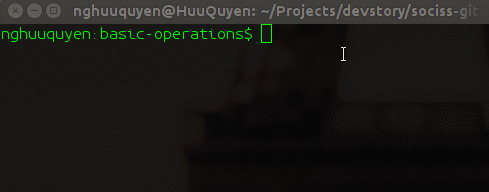

# Branch - Tìm hiểu về các thao tác trên nhánh

# I. Giới thiệu

Bài học gồm hai phần.

Phần đầu gồm những kỹ thuật căn bản trên nhánh, phần thứ hai là hướng dẫn các kỹ thuật nâng cao trên nhánh. Nội dung hai phần như sau.


## Phần 1. Căn bản

1) Tạo mới.

2) Liệt kê danh sách các nhánh

3) Chuyển đổi qua lại giữa các branch

4) Chuyển đổi giữa branch nhưng bị yêu cầu commit code

5) So sánh thay đổi giữa các branch

6) Đẩy mã nguồn một local branch lên remote branch

7) Cập nhật local branch với thay đổi ở remote branch

8) Tạo mới nhánh tại một commit cụ thể

9) Xóa nhánh

10) Phục hồi branch sau đã xóa

11) Khôi phục lại local branch về trạng thái trước đó


## Phần 2: Nâng cao

1) Merge branch.

2) Xử lý xung đột trên branch khi merge.

3) Phục hồi trạng thái của branch nếu merge thất bại.

4) Phục hồi lại remote branch nếu phát hiện có lỗi trong commit đã push.

# Phần 1. Căn bản

# 1. Tạo mới một nhánh

Để tạo mới một nhánh đơn giản là dùng lệnh `git checkout`. Khi thực hiện lệnh này trên nhánh nào, thì nhánh mới sẽ giống hoàn toàn nhánh đó. Tham số -b trong lệnh checkout là để chỉ việc tạo mới một nhánh.


Ví dụ:

```sh
git checkout master
git checkout -b new_branch
```

Kết quả là new_branch sẽ có code và lịch sử giống hoàn toàn với master.


# 2. Liệt kê danh sách các nhánh

Để liệt kê danh sách các nhánh ta dùng lệnh `git branch`. Kết quả trả về là toàn bộ các nhánh có trong repo. Trong đó nhánh có dấu hoa thị `*` là nhánh hiện tại ta đang đứng.


Ví dụ:

```sh
git branch
  dev
* master
```

Như trên là ta đang ở nhánh master.


# 3. Chuyển đổi qua lại giữa các branch

Để chuyển đổi qua lại giữa các nhánh, ta dùng lệnh `git checkout TÊN_NHÁNH`. Chú ý là không có tham số -b nhé.



Ví dụ

```sh
git checkout dev
Switched to branch 'dev'
git checkout master
Switched to branch 'master'
```

# 4. Chuyển đổi giữa branch nhưng bị yêu cầu commit code

Trong trường hợp bạn chuyển sang nhánh mới khi đang code dang dở, thì sẽ bị yêu cầu commit code, tuy nhiên không phải lúc nào bạn cũng muốn commit code cả. Có một cách là sẽ đẩy toàn bộ working tree hiện tại vào stash bằng lệnh `git stash`. Sau đó khi muốn lấy lại working tree đang làm thì dùng lệnh `git stash pop` để lấy ra.

```sh
git stash

git checkout dev
... Do something ....
... Done, and back to master ....

git checkout master
git stash pop
```

# 5. So sánh thay đổi giữa các branch

Nếu bạn muốn so sách các commit hoặc các file khác biệt giữa hai nhánh bất kỳ thì dùng lệnh `git diff`.


Ví dụ so sách master với dev

```sh
git diff master dev
```

Nếu chỉ muốn xem tên những file khác nhau ở hai nhánh thì dùng thêm tham số --name-only.

```sh
git diff master dev --name-only
```

# 6. Đẩy mã nguồn một local branch lên remote branch

Cái này đơn giản là ta checkout đến nhánh muốn đẩy, commit code xong rồi push lên remote origin thôi.
Ví dụ


```sh
git checkout master
git add data.txt
git commit -m "Update data.txt"
git push origin master
```

Code trên nhảy đến nhánh master sẽ đẩy lên nhánh master ở remote origin.

# 7. Cập nhật local branch với thay đổi ở remote branch

Khi hai người cùng làm việc trên một nhánh, việc người này phải cập nhật code mới của người kia là điều bình thường. Để làm việc này dùng lệnh `git pull`.


Ví dụ.

```sh
git pull origin master
```
Lệnh trên sẽ kéo code từ nhánh master trên remote repo về nhánh ở local hiện tại.

**Lưu ý**

1) Bạn có thể từ nhánh này pull code nhánh khác về, ví dụ pull code nhánh dev về master.
2) Bạn phải có thiết lập remote repo rồi thì mới pull được, dùng `git remote -v` để kiểm tra tên và URL của remote repo.
3) Lệnh `git pull` bên trong sẽ thực hiện hai lệnh `git fetch` và `git merge`
4) Lệnh `git pull` sẽ tự động **fast-forward** nếu có thể, nên nếu muốn luôn luôn tạo ra một merge commit để dễ quản lý và khôi phục thì nên dùng thêm đối số **--no-ff**.  ví dụ

```sh
git pull origin master --no-ff
```
Lúc này bạn luôn phải nhập merge commit message cho lần pull đó.

**Ưu điểm** : Cái này tiện là sau này đọc log sẽ biết bạn pull code vào lúc nào, tránh trường hợp có quá nhiều commit con được merge vào gây khó quản lý và khôi phục khi có lỗi xảy ra.

**Nhược điểm**: Sẽ gom các commit con lại thành một, nên khi bị lỗi phải gỡ bỏ, thì phải gỡ luôn cả cục đi. Đôi khi phải gỡ đi cả những tính năng chạy được. Vì vậy nên khi commit và tạo pull request thì nên tạo theo một tính năng cụ thể, tránh hỗn hợp lộn xộn.


# 8. Tạo mới nhánh tại một commit cụ thể

Trường hợp bạn muốn tạo ra một nhánh có code tương ứng với một commit nào đó. Thì giải pháp là bạn sẽ tạo ra một nhánh mới với **HEAD trỏ tới commit hoặc một tag** cụ thể nào đó.

Ví dụ mình muốn nhánh quay về trạng thái ở commit có mã là **634ef682** thì lúc này mình muốn có một nhánh mới tên là **old-dev** với trạng thái code ở commit trên, thì làm như sau.


```sh
git checkout -b old-dev 634ef682
```

Sau đó bạn sẽ có một nhánh mới tên là **old-dev** có mã nguồn tương ứng với commit 634ef682.

**Ứng dụng** :

1) Quản lý phiên bản khi kết hợp với `git tag`. Ví dụ câu lệnh `git checkout -b release-v1.5.1 v1.5.1-stable` sẽ tạo ra nhánh release cho production tương ứng với phiên bản có tag là **v1.5.1-stable**.

2) Có thể ứng dụng trong việc debug lỗi để xem tại commit nào trên nhánh thì bị lỗi để có thể tạm thời quay về một commit nào đó gần nhất có thể dùng được.

3) Để đọc lại code cũ dễ dàng hơn, và còn nhiều ứng dụng khác tùy vào bạn ứng dụng ra sao.

Phần thao tác với Tag để quản lý phiên bản và mô hình phân nhánh tiêu chuẩn cho Git mình sẽ viết ở bài học khác.


# 9. Xóa nhánh

Để xóa một nhánh thì đơn giản là bạn dùng câu lệnh `git branch -d TÊN_NHÁNH` để xóa một nhánh bất kỳ.


ví dụ

```sh
git branch -d dev
```

Câu lệnh trên sẽ xóa nhánh dev nếu thỏa hai điều trên. Trong đó tham số -d (viết thường) là ám chỉ việc chỉ xóa nhánh khi nhánh đó đã đồng bộ với nhánh trên upstream tương ứng hoặc đã merge thành công vào HEAD hiện tại. **Nếu bạn muốn xóa dev bằng mọi giá** thì hãy dùng chữ -D (D hoa) thì Git sẽ xóa nhánh bất chấp bất cứ điều gì xảy ra.


**Lý thuyết sâu hơn** :

**1) Tại sao khi dùng -d lại phải thỏa điều kiện đồng bộ với nhánh trên upstream tương ứng hoặc merge thành công vào HEAD hiện tại ?**

-> Trả lời câu hỏi thứ nhất, đơn giản là vì Git không muốn bạn bị mất mã nguồn trên nhánh bị xóa, nên nó mới đòi hỏi bạn phải merge nhánh đó vào đâu đó hoặc push code lên nhánh upstream tương ứng trên remote repo đã.

**2) Khi nào nên dùng -D ?**

-> Khi bạn biết chắc chắn code trên nhánh bạn muốn xóa không có giá trị gì hết, nên không cần thiết phải đồng bộ lên remote hay merge gì cả. Thường là nhánh tạo ra để thử nghiệm cái gì đó thôi, xong rồi thì xóa đi.


# 10. Phục hồi branch sau khi đã xóa

Việc lỡ tay hay do nhầm lẫn mà xóa một branch là chuyện bình thường, trong trường hợp này vẫn có thể cứu được nếu còn reflog. Các bước như sau

**Video hướng dẫn**


**Bước 1: mở lịch sử reflog**

```sh
git reflog
```

**Bước 2: Tìm commit gần nhất có lịch sử liên quan đến nhánh bị xóa**

```sh
nghuuquyen:basic-operations$ git reflog
cbc2046 HEAD@{0}: checkout: moving from master to old-master
5493f45 HEAD@{1}: checkout: moving from old-master to master
```

Giả sử mình xóa mất nhánh **old-master** , đọc trong reflog từ trên xuống dưới thì thấy ở commit **cbc2046** có message là **checkout: moving from master to old-master** nghĩa là chuyển từ nhánh master sang old-master, như vậy **tại thời điểm commit cbc2046** nhánh old-master vẫn còn nguyên vẹn.

Nên ta sẽ khôi phục lại nhánh old-master bằng commit **cbc2046**


**Bước 3 : Phục hồi nhánh bằng cách checkout đến commit đã chọn**

Lúc này chúng ta sẽ checkout ra một nhánh mới với tên là old-master đến commit đã chọn ở bước hai, nhánh old-master sẽ được khôi phục nguyên vẹn.

```sh
git checkout -b old-master cbc2046
```


# 11. Khôi phục lại local branch về trạng thái trước đó

**Video hướng dẫn**

Đây là trường hợp khi bạn làm một thời gian, thì thấy các commit gần đây hoàn toàn sai lầm, và muốn xóa bỏ hết tất và quay lại một trạng thái commit trước đó trong trường hợp là các **commit lỗi này chưa đươc đẩy lên remote repo**. Thì bạn sẽ dùng `git reset` theo các bước sau.

**Bước 1** Xác định commit mà mình muốn quay về.

**Bước 2** Dùng lệnh git reset với tham số là commit ID được chọn.

Bước này dùng lệnh `git reset [commit_ID]` cộng với một trong ba đối số dưới đây

1) **--sort** :  Sẽ giữ lại cả index(của commit đích) và working tree hiện tại. Hay nói đơn giản là nó quay lại trạng thái mà commit đó chưa được tạo (bạn chỉ mới add và staging area thôi).

2) **--mixed**: Sẽ xóa bỏ index (Hay staging area của commit đích) còn working tree hiện tại sẽ còn nguyên. Hay nói đơn giản hơn nó sẽ nhảy đến trạng thái commit đã tạo và HEAD đã trỏ đến commit đó.

3) **--hard** :   Sẽ xóa bỏ cả index và cả working tree hiện tại. Hay nói đơn giản hơn là không lưu luyến gì cả, HEAD lúc này sẽ trở đến commit được chọn và working tree sẽ trống trơn.

```sh
git checkout dev
git reset 8062f9 --hard
```

Với câu lệnh trên, nhánh dev sẽ quay ngược về đúng trạng thái code sau khi đã thực hiện commit với ID là 8062f9.


# Phần 2. Nâng cao

# 1. Merge branch


Cái này áp dụng khi bạn checkout ra một branch mới để làm một tính năng, sau khi làm xong thì bạn sẽ nhập tính năng đó về lại nhánh chính.

Trong phần 1 này mình giả sử không có xung đột nào hết, thì bạn làm như sau


**Bước 1**: Di chuyển đến nhánh cần đích cần merge code từ nhánh tính năng vào

Ví dụ bạn đang ở nhánh feature-homepage để làm trang chủ, và đã xong. Lúc này bạn muốn merge code về nhánh master thì bạn sẽ checkout về nhánh master.

```sh
git checkout master
```

**Bước 2**: Chạy lệnh git merge

Giả sử như trên là bạn muốn merge nhánh feature-homepage vào master thì từ nhánh master bạn chạy lệnh sau

```sh
git merge feature-homepage
```
Và lúc này màn hình Vim đòi bạn nhập message cho lần merge sẽ nhập lên, bạn có thể chỉnh sửa hoặc tắt đi bằng Ctrl + x thì nó sẽ tự để mặc định. Và việc merge đã hoàn thành.


# 2. Xử lý xung đột trên branch khi merge.

Khi cả hai nhánh đều cùng chỉnh sửa một tệp tin nào đó, thì lúc merge với nhau sẽ gây xung đột.

**Video hướng dẫn**

## 2.1 Tạo ra xung đột

Đầu tiên chúng ta sẽ **thử thực hành tạo ra một xung đột giữa hai nhánh** theo các bước sau.

**Bước 1:** Tạo ra một tệp tin data.txt trên nhánh master, sau đó add và commit

```sh
git checkout master
git add data.txt
git commit -m "Create data.txt file"
```

**Bước 2:** Từ nhánh master, tạo ra một nhánh mới là dev

```sh
git checkout -b dev
```

**Bước 3:** Tại nhánh dev, chỉnh sửa file data.txt, sau đó commit và checkout về master lại

```sh
... Do change content file data.txt ...
git add data.txt
git commit -m "Change data.txt on dev"
git checkout master
```

**Bước 4:** Tại nhánh master cũng chỉnh sửa file data.txt, sau đó commit.

```sh
... Do change content file data.txt ...
git add data.txt
git commit -m "Change data.txt on master"
```

Sau bước 4 nhánh master và nhánh dev đã cùng chỉnh sửa một file là data.txt. Và đó là nguyên nhân gây ra xung đột

**Bước 5:**  Tại nhánh master chạy lệnh merge nhánh dev vào, và lúc này sẽ thấy báo xung đột.

```sh
git merge dev

Auto-merging data.txt
CONFLICT (content): Merge conflict in data.txt
Automatic merge failed; fix conflicts and then commit the result.
```

Kết quả trả về là xung đột file data.txt

**Bước 6:** Ở nhánh master, chạy lệnh `git status -s`

```sh
git status -s
UU data.txt
```

Lúc này sẽ thấy file data.txt có trạng thái là **UU**

Trong đó:

U = updated but unmerged ( Cập nhật mà không merge được)

Nên UU nghĩa là : unmerged, both modified ( Cả hai đều cập nhật và không merge được)


## 2.2 Giải quyết xung đột

Tiếp theo, chúng ta **tiến hành giải quyết xung đột như sau**.

**Bước 1**: Chạy lệnh `git status -s`, tìm những file có trạng thái là UU. Đó là những file cần xử lý

**Bước 2**: Lần lượt mở từng file có trạng thái UU lên để chỉnh lại mã cho đúng .

Bước này gọi là xử lý xung đột, ví dụ như file data.txt ở trên có thể có nội dung như dưới đây.

```
<<<<<<<> HEAD
change on master
=======
Change on dev
>>>>>>> dev
```
Như trên nghĩa là phần nội dung ở phía trên là nội dung hiện tại ở HEAD (Chỉ nhánh master), còn phần nội dung bên dưới là phần ở nhánh dev.

Cách xử là là tùy ở bạn, ví dụ với mình thì mình thấy chỉ cần giữ lại cả hai dòng là xong. Như mình bên dưới là đã xử lý xong, nhớ xóa bỏ hết tất cả các ký tự đặc biệt của Git đi nhé.

```sh
change on master
Change on dev
```

Lưu lại file data.txt

**Bước 3**: Sau khi đã chỉnh sửa xong hết các file bị xung đột thì add và commit.

```sh
git add .
git commit -m "Merge branch 'dev'"
```

Lúc này đã giải quyết xung đột xong và merge hoàn tất.


# 3.Phục hồi trạng thái của branch nếu merge thất bại.


Sẽ có lúc bạn bị xung đột nhưng không thể giải quyết được ngay lúc đó, hoặc bạn không thể giải quyết mà đã lỡ gọi lệnh merge, thì để khôi phục lại trạng thái ban đầu rất đơn giản. Dùng lệnh `git merge --abort` hoặc lệnh `git reset` đều được.

Lệnh này sẽ quay về trạng thái trước khi thực hiện lệnh merge, nó sẽ clean toàn bộ index và working tree (**nên dùng**).

```sh
git merge --abort
```


Còn rệnh `git reset HEAD --hard` sẽ khôi phục hoàn toàn mã nguồn về trạng thái ban đầu của HEAD (Nếu dùng cái này thì bạn nên kiểm tra xem hiện tại HEAD đang ở đâu bằng `git log` cho an toàn nhé).

```sh
git reset --hard
```

**Lưu ý** : Mình dùng --hard vì mình biết rằng, trước khi bạn merge code thì nếu working tree không Clean (rỗng) thì Git đã ép bạn commit hoặc đẩy vào stash trước rồi. Nên dùng --hard để clean sạch index và working tree sinh ra trong lúc merge thất bại là hợp lý nhất.


# 4. Phục hồi lại remote branch nếu phát hiện có lỗi trong commit đã push.

Đây là một trường hợp mà khi bạn đã lỡ push code lên remote repo mà lại phát hiện ra lỗi. Lúc này sẽ có hai trường hợp.

1) Chưa có ai pull, push code hoặc nhánh remote đó chỉ của riêng bạn dùng.

2) Đã có ai đó pull code hoặc push code lên nhánh ấy.


## 4.1 Trường hợp chưa có ai pull, push code hoặc nhánh remote đó chỉ của riêng bạn dùng


Trong trường hợp này có hai cách giải quyết.

**Cách 1: Ghi đè để khôi phục lại nhánh remote (Nguy hiểm)**

**Bước 1** : Lưu working tree hiện tại nếu có bằng cách commit hoặc git stash.

**Bước 2** : Trên nhánh bị lỗi, khôi phục lại code đến commit không bị lỗi bằng `git reset --hard`

Mở log hoặc reflog tìm lại đến commit không bị lỗi, giả dụ là **A**. Thì lúc này bạn sẽ reset nhánh về commit đó bằng lệnh sau.

```sh
git reset --hard A
```

Thay A bằng commit ID bạn chọn. Ví dụ như hình.


**Bước 3** : Tiến hành push lên nhánh trên origin với tham số `-f`

```sh
git push orgin [branch_name] -f
```

Lệnh push với tham số `-f` là rất nguy hiểm, nó có nghĩa là ghi đè nội dung, bất chấp điều gì xảy ra. Nhờ vào sự ghi đè bất chấp này mà nhánh trên remote sẽ được khôi phục lại như ban đầu.

Tới đây thì đã cứu xong remote branch, nhưng ở local branch bạn lại đối mặt với việc là HEAD của bạn đã nhảy lùi về nhiều commit trước đó. Nên ở dưới local bạn lại phải một lần nữa dựa vào reflog để khôi phục lại trạng thái của branch bị lỗi trước đó để chỉnh sửa lại cho phù hợp rồi push lên lại. Khá là vất vả đó.


**Cách 2: Bạn sửa lỗi xong rồi đẩy lên nhánh lại**

Cách này thì rất bình thường, bạn cứ ung dung fix lỗi rồi đẩy lên lại, vì nếu nhánh đó của riêng bạn thì hoàn toàn không có vấn đề gì cả. Tuy nhiên phải để ý về thời gian, tránh người khác pull về rồi lại lây lan bug ra.

**Bước 1** : Pull lại code từ nhánh trên remote để chắc chắn là mới nhất

**Bước 2**: Sửa lại lỗi bạn gây ra và commit

**Bước 3**: Push code lên lại , lúc này push **không cần tham số -f** nhé.


## 4.2 Đã có ai đó pull code hoặc push code lên nhánh ấy

Trong trường hợp này có hai cách giải quyết,

**Cách 1: Bạn sửa lỗi xong rồi đẩy lên nhánh lại nhưng phải đăng thông báo ngay cho mọi người**

Đăng thông báo để tránh gây lây lan bug rồi lo fix thật nhanh để team khỏi phải chờ :D.


**Cách 2: Bạn sẽ thu hồi lại commit lỗi bằng lệnh revert**

**Video hướng dẫn**

Cách hai bạn sẽ dùng lệnh `git revert` để thu hồi commit, đây là cách phổ biến nhất và được khuyến khích dùng. Bản chất là nó tạo ra một revert commit làm ngược lại những thay đổi của commit bị lỗi để thu hồi lại chính commit đó (Nôm na là nếu bạn ghi vào một dòng gây lỗi thì đơn giản làm ngược lại là xóa dòng đó đi là xong). cách thực hiện rất đơn giản


**Bước 1** : dùng git log hoặc git reflog để tìm lại commit gây lỗi, bạn phải xác định được commit nào gây lỗi.

**Bước 2** : Chạy lệnh thu hồi commit gây lỗi đó

ví dụ 6058faa là commit gây lỗi, thì ta chạy lệnh sau

```sh
git revert 6058faa
```

**Bước 3**: Giải quyết xung đội nếu có và add các file bi xung đột đã giải quyết.

**Bước 3'**: Nếu có xung đột ở bước 3, thì sau khi giải quyết xong chạy lệnh `git revert --continue` để hoàn tất việc giải quyết xung đột. **Nếu không có xung đột** Git tự động bỏ qua bước này.

**Bước 4** : Nhập revert commit message nói vì sao bạn lại gỡ bỏ commit này và lưu lại

Thường bước này nó hiển thị trong Vim, nên nhấn `ctrl + o` để lưu rồi `ctrl + x` để thoát và hoàn tất nhé.

Tới đây là xong rồi, bạn có thể push lại lên nhánh remote kia, mọi người cũng sẽ pull về bình thường :D.

# Nhận xét và kết luận

Sau bài học này mình đã giới thiệu đến mọi người các kỹ thuật Git hay dùng trên một nhánh, hiểu các kỹ thuật này sẽ giúp bạn làm việc với Git thuận tiện và chuyên nghiệp hơn.

Ở bài học tiếp theo, chúng ta sẽ học về Git Rebase và các kỹ thuật thao tác trên Commit.


# Tác giả

**Name:** Nguyen Huu Quyen ( Nguyễn Hữu Quyền )

**Email:** nghuuquyen@gmail.com

**Website:** [Sociss Class - Online Education Center](https://sociss.edu.vn/)

**Profile Page:** [Nguyen Huu Quyen - Profile Page ](https://sociss.edu.vn/users/nghuuquyen)
