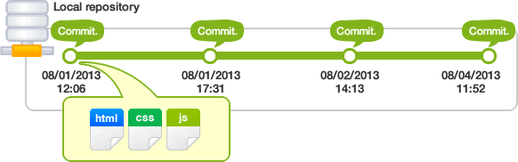

Chào các bạn trong bài học này, mình muốn giới thiệu đến các bạn công nghệ Git. Git là một công cụ giúp quản lý các phiên bản của mã nguồn, hỗ trợ cho làm việc nhóm một cách hiệu quả.


Trong  bài học này, mình sẽ giới thiệu và giải thích tất cả các khái niệm trung tâm và quan trọng nhất khi làm việc với Git. Nắm chắc những khái niệm này thì việc thực hành và đi sâu vào các câu lệnh về Git sẽ vô cùng dễ dàng.

Nào chúng ta cùng đi vào bài học.


# 1. Tại sao cần Git ?

Trong việc phát triển phần mềm chúng ta thường thao tác trên rất nhiều tệp tin khác nhau. Với mỗi tệp tin chúng ta sẽ tương tác chỉnh sửa rất nhiều lần. Câu hỏi đặt ra là làm thế nào để có thể phục hồi trạng thái của tệp tin đó trở lại trạng thái trước đó nếu lỡ chúng ta gây ra lỗi.

Thì cách đơn giản nhất đó chính là sao lưu cẩn thận nó sau mỗi lần làm việc, theo một cách đặt tên thống nhất ví dụ.

```markup
(18-09-2017)-core.server.controller.js
(19-09-2017)-core.server.controller.js
(20-09-2017)-core.server.controller.js
```

Cách trên cũng là một giải phát có thể áp dụng được tốt nếu chúng ta làm việc một mình, tuy nhiên để dễ quản lý hơn trước đây mình còn làm tên một file text để viết vào đó dòng mô tả xem ứng với phiên bản file đó thì mình làm công việc gì. Ví dụ về file text mình từng dùng

```markup
# 1. (18-09-2017)-core.server.controller.js
Complete view feature.

# 2. (19-09-2017)-core.server.controller.js
Add new feature show contact page.

# 3.(20-09-2017)-core.server.controller.js
Add new feature show about page.

```

Đó là cách mình quản lý source code của mình vào năm mình học cấp 3. Lúc ấy mình chưa biết GIT là gì, tuy nhiên khi đến lúc làm việc nhóm thì sẽ vô cùng phức tạo vì để chuyển giao mã nguồn cho bạn của mình, thì chỉ có cách nén lại gửi qua email. Việc nén gửi đi tạo ra vô số bản sao chép gây khó kiểm soát. Kế đến còn có trường hợp cả hai cùng sửa cùng một file nếu copy đè lên sẽ gây mất code của người kia, dần dần mọi việc trở nên hỗn loạn. Và cả nhóm phải đành code trên một máy hoặc share một thư mục chung qua mạng, vất vả vô cùng.


Sau này biết đến Git mọi thứ đều thay đổi, việc làm việc nhóm trở nên đơn giản và hiệu quả hơn. Ngay cả công việc code cá nhân cũng trở nên dễ dàng, mình không còn phải sao lưu từng tệp tin nữa.


# 2. Git là gì ?

Git là một trong những Hệ thống Quản lý Phiên bản Phân tán, vốn được phát triển nhằm quản lý mã nguồn (source code) của Linux.

Trên Git, ta có thể lưu trạng thái của file dưới dạng lịch sử cập nhật. Vì thế, có thể đưa file đã chỉnh sửa về trạng thái cũ hay có thể biết được file đã được chỉnh sửa chỗ nào do ai đã chỉnh sửa.

Thêm nữa, khi định ghi đè (overwrite) lên file mới nhất đã chỉnh sửa của người khác bằng file đã chỉnh sửa dựa trên file cũ, thì khi upload lên server sẽ hiện ra cảnh cáo. Vì thế, sẽ không xảy ra lỗi khi ghi đè lên nội dung chỉnh sửa của người khác mà không hề hay biết.

Git sử dụng mô hình phân tán, mỗi thành viên trong team sẽ có một repository ở máy của riêng mình. Điều đó có nghĩa là nếu có 3 người A,B,C cùng làm việc trong một project. Thì bản thân repo trên máy của người A, người B, và người C có thể kết nối được với nhau.

Trong mô hình Git sẽ luôn có một server lưu trữ chính để cả team cùng kết nối thông qua đó (Có thể là Github, bitbucket, ...). Ngoài ra  mỗi người trong team đều có thể kết nối đến máy tính của nhau thông qua SSH.

# 3. Repository là gì ?

Repository hay được gọi tắt là Repo, đơn giản là nơi chứa tất cả những thông tin cần thiết để quản lý các sửa đổi và lịch sử của toàn bộ project. Tất cả dữ liệu của Repo đều được chứa trong thư mục bạn đang làm việc dưới dạng folder ẩn có tên là .git

Nên bạn phải chú ý không được xóa thư mục này đi, nếu không sẽ mất thông tin quan trọng.


# 4. Remote repository và local repository

Repository của Git được phân thành 2 loại là **remote repository** và **local repository**.

+ **Remote repository**: Là repository dùng để chia sẽ giữa nhiều người và bố trí trên server chuyên dụng.

+ **Local repository**: Là repository ở trên máy tính của chính bản thân mình, dành cho một người dùng sử dụng.

Thường thì trong quá trình làm việc chúng ta sẽ làm việc trên local repo, tức là lưu trữ trên máy của mình. Khi muốn chia sẽ nó đến người dùng khác khi đã hoàn thành thì sẽ đẩy code (Push) lên Remote repo.

# 5. Git Remote

Để kết nối được với một repo khác người ta sử dụng một khái niệm gọi là remote tạm hiểu là
kết nối từ xa đến một remote git server. Là một máy tính trên đó cài phần mềm git
server để quản lý source code. Tai đây chúng ta có thể thực hiện các thao tác như
đẩy (push), kéo (pull) , nhân bản (clone) . Tuy nhiên thường thì không phải máy tính
ai cũng cài đặt git server và đảm bảo hoạt động ổn định 24/24, nên thường là người ta
sẽ sử dụng một dịch vụ Cloud Git Server nào đó để làm remote server. Hai nhà cung cấp
ổn định nhất hiện tại là github.com và bitbucket.org.

Mọi người sẽ có tài khoản của các nhà cung cấp trên, kết nối đến đó và đẩy mã nguồn
của mình lên đó để các thành viên khác lên đó lấy về. Dựa vào đó mà mọi thành viên
có thể chia sẽ mã nguồn với nhau dễ dàng mọi thứ sẽ được đồng bộ trên remote server.

Vì vậy, trước khi sử dụng git thì bạn nên đăng kí một tài khoản trên github.com hoặc bitbucket.org.


# 6. Commit



**Commit** là thao tác để **ghi lại** lịch sử việc thêm, thay đổi file hay thư mục vào repository.

Khi thực hiện commit, trong repository sẽ tạo ra commit (hoặc revision) đã ghi lại sự khác biệt từ trạng thái đã commit lần trước với trạng thái hiện tại.

Commit này đang được chứa tại repository, các commit nối tiếp với nhau theo thứ tự thời gian. Bằng việc lần theo commit thì có thể biết được lịch sử thay đổi trong quá khứ.

# 7. Nhánh (Branch)


Nhánh có thể hiểu như là một không gian làm việc (workspace), Ví dụ khi bạn muốn
tạo một tính năng A mới bạn sẽ tạo ra một nhánh mới để làm tính năng A. Đồng thời
trong lúc bạn làm tính năng A thì bạn cũng có thể tạo ra một nhánh mới để sửa lỗi
cho dự án của mình. Hai không gian làm việc này hoàn toàn không động đến nhau, nên
dù tính năng A đã làm xong hay chưa đều không ảnh hưởng đến các nhánh (không gian làm việc) khác.

Trong một project sẽ luôn có một nhánh chính (mặc định) gọi là **master**. Tính năng được tạo
ra trong các nhánh phụ sẽ được hợp nhất lại vào master khi đã làm xong, hành động này
gọi là **merge**

# 8. Merge (Trộn)

Merge là hành động khi bạn muốn nhập mã nguồn từ một nhánh khác vào nhánh hiện tại.
Ví dụ từ nhánh master bạn tạo ra một nhánh là **feature-seo** đây là nhanh phát triển
tính năng cho việc SEO onpage. Sau khi bạn hoàn tất tính năng này thì bạn sẽ phải merge
nó vào lại master, vì master là nhánh chính, hiểu là nơi chứa mã nguồn với đầy đủ tính năng
của cả project. Việc merge sẽ mang tính năng seo đang ở nhánh **feature-seo** vào nhánh **master**

# 9. Working tree và Index (hoặc staging area)


Trên Git, những thư mục được đặt trong sự quản lý của Git, để mọi người thực hiện công việc trên đó, được gọi là **working tree**.

Giữa repository và working tree tồn tại một nơi gọi là index hay staging area . staging area là nơi để chuẩn bị cho việc commit vào repository.


# 10. Tracked và Untracked

Trong git có hai loại trạng thái chính đó là Tracked và Untracked. Nếu bạn muốn commit một tập tin đó, bạn sẽ cần phải đưa tập tin đó vào trạng thái tracked bằng lệnh **git add**.


1) **Tracked** – Là tập tin đã được đánh dấu theo dõi trong Git để bạn làm việc với nó. Và trạng thái Tracked nó sẽ có thêm các trạng thái phụ khác là Unmodified (chưa chỉnh sửa gì), Modified (đã chỉnh sửa) và Staged (đã sẵn sàng để commit).

2) **Untracked** – Là tập tin còn lại mà bạn sẽ không muốn làm việc với nó trong Git.

Nhưng nếu tập tin đó đã được Tracked nhưng đang rơi vào trạng thái (Modified) thì nó vẫn sẽ không thể commit được mà bạn phải đưa nó về Staged cũng bằng lệnh git add


## Untracked

Nếu bạn tạo ra hoặc thêm vào một tập tin mới vào trong thư mục làm việc của bạn thì nó sẽ ở trạng thái Untracked. muốn cho nó trở thành tracked thì phải dùng lệnh
git add. Nếu tệp tin đó mới hoàn toàn thì nó sẽ rơi vào trạng thái **staged** và
bạn có thể commit file đó.

## Tracked

Một khi một tập tin đã được đưa về Tracked thì nó sẽ có thể thay đổi giữa 3 trạng thái khác nhau là Modified, Unmodified và Staged.


1) **Unmodified** : File đươc Git quản lý nhưng không có thay đổi gì
2) **Modified** :File được Git quản lý nhưng đang bị thay đổi, cần dùng lệnh git add để đưa về trạng thái staged
3) **staged** : File được git quản lý và sẵn sàng cho việc commit.


**Chú ý** : Một file đã ở trạng thái Staged mà bạn lại tiếp tục sửa thì nó
sẽ quay về trạng thái modified, lúc này lại cần git add để xác nhận thay đổi,
và đưa file quay về trạng thái staged.

# 11. tệp tin .gitignore

.gitignore Là một file cấu hình của git. **Tại khai báo tất cả các file hoặc thư mục mà ta sẽ untracked**. Tức là khai báo những file mà ta không muốn git quản lý, những file này sẽ không bao giờ được commit.

Ứng dụng của file này là để loại bỏ các tệp tin thừa do hệ điều hành, công cụ làm việc sinh ra trong lúc làm việc, những file này không có giá trị nên không bao giờ
cần phải quản lý bởi Git cả.


**Chú ý** : Thường khi làm việc với một công nghệ cụ thể nào đó thì đề có một
file .gitignore mẫu sẵn, bạn có thể lên mạng tải về để sử dụng, trong quá trình
sử dụng bạn có thể thêm vào file .gitignore các file đặc biệt mà bạn muốn bỏ ra khỏi Git tương ứng với công việc của bạn.

**Ví dụ** Với ngôn ngữ Java, khi mã nguồn được biên dịch, thì file .class sẽ được sinh ra, nhưng file này lại không cần phải quản lý bởi Git do nó sinh ra từ file
.java. Nên ta sẽ loại bỏ nó bằng cách khai báo trong .gitignore là

```markup
*.class
```

Ở trên nghĩa là bỏ hoàn toàn các file có phần mở rộng là .class.


# 12. Add, Pull, Push, Clone

**add** là thao tác đẩy một tệp tin từ working directory vào staging area để chuẩn bị cho việc commit.

**pull** là thao tác lấy mã nguồn từ một hoặc nhiều nhánh cụ thể nào đó ở
remote server nào đó về  local repository trên máy tính của bạn

**push** là thao tác đẩy mã nguồn hiện tại đã được commit của bạn lên remote server.

**clone** là thao tác tải mã nguồn từ một remote server về máy tính,chỉ tải
về máy local repository nhánh master

# 13. Conflict (Xung đột)

Giả sử ta có file A. Và trong team gồm hai anh chị làm việc ở hai nhánh khác nhau.
Ví dụ tại dòng số 10 đến 20 của file A. Anh lập trình viên viết vào đó hàm cộng, nhưng chị lập trình viên khác trên một nhánh khác lại viết vào đó hàm trừ.Lúc này khi anh lập trình viên
merge code từ nhánh của chị kia về  thì Git bó tay không biết nên theo ai, nên sẽ báo Conflict (xung đột).


Vậy Conflic là trường hợp có 2 sự thay đổi trong cùng một hay nhiều dòng code trên một file mà Git không thể tự quyết định cách giải quyết cho "đúng" khi merge mã nguồn từ một nhánh khác về . Đúng ở đây có nghĩa là đúng "ý đồ của lập trình viên".

Để giải quyết mâu thuẫn bạn phải dùng “tay" hay ám chỉ tự xử, để sữa các xung đột này. Bạn đơn giản chỉ việc nhìn vào file bị conflict cùng với các cộng sự của mình để tự quyết định dòng code nào giữ lại, dòng nào xóa bỏ hay phối hợp với nhau.

Như ví dụ trên, khi xảy ra xung đột, lúc này để giải quyết hai anh chị lập trình viên phải ngồi với nhau để sắp xếp lại hai function đúng vị trí trong file A. Và đó gọi là giải quyết xung đột.


# Tác giả

**Name:** Nguyen Huu Quyen ( Nguyễn Hữu Quyền )

**Email:** nghuuquyen@gmail.com

**Website:** [Sociss Class - Online Education Center](https://sociss.edu.vn/)

**Profile Page:** [Nguyen Huu Quyen - Profile Page ](https://sociss.edu.vn/users/nghuuquyen)
