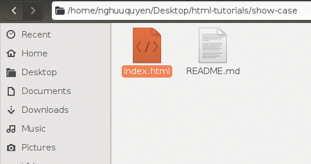
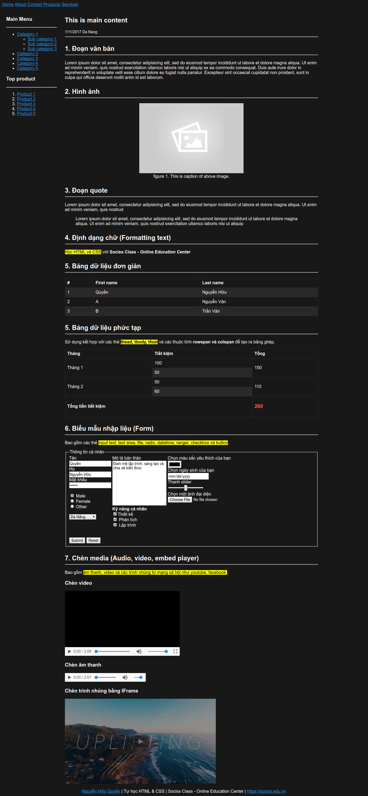

Chào các bạn, trong bài học lần này mình sẽ hướng dẫn các bạn về HTML, ngôn ngữ đánh dấu văn bản dùng để trình bày nội dung của trang web.


# I. HTML là gì ?

HTML là từ viết tắt của HyperText Markup Language, nghĩa là ngôn ngữ đánh dấu siêu văn bản.

Trong đó `ngôn ngữ đánh dấu` và `siêu văn bản` được định nghĩa như sau:

1) **ngôn ngữ đánh dấu** là một ngôn ngữ gồm một tập các thẻ đánh dấu `tag`, mà nội dung bên trong của thẻ đánh dấu sẽ được điều chỉnh tùy theo chức năng của thẻ đánh dấu.


Ví dụ chúng ta sử dụng thẻ đánh dấu <b></b> có chức năng bôi đậm nội dung chữ chứa bên trong nó. Nếu ta dùng chúng để đánh dấu đoạn văn bản Sociss Class thì ta sẽ được kết quả là chữ Sociss Class được in đậm.

```html
<b>Sociss Class</b>
```

2) **siêu văn bản** Siêu văn bản là một văn bản tích hợp nhiều dạng dữ liệu khác nhau như hình ảnh, chữ, video, âm thanh và các siêu liên kết đến các trang khác.

Trong đó **siêu liên kết** (hyperlink), hay đơn giản là liên kết (link), là một tham chiếu đến tài liệu khác hay một nguồn khác.


# II. Môi trường để học các dùng HTML

Bạn chỉ cần có một trình duyệt, và một trình soạn văn bản là đủ.  Để chạy thử trang HTML đầu tiên. Bạn làm theo các bước sau.


1) **Bước 1** : Tạo một file text bất kỳ và lưu với định dạng HTML (đuôi .html)

2) **Bước 2** : Điền vào trong đó nội dung dưới đây.

```html
<!DOCTYPE html>
<html lang="vi-VN">
<head>
  <meta charset="utf-8">
  <!-- Phần meta header của trang web -->
  <title>Tiêu đề của trang</title>
</head>
<body>
  Toàn bộ nội dung dung trang chứa ở đây
</body>
</html>
```

3) **Bước 3** : Mở tệp tin ở bước trên bằng trình duyệt.

Hầu hết các máy tính đều có thể mở trực tiêp file bằng các nhấp chuột phải vào file html rồi chọn mở bằng trình duyệt mặc định. Tuy nhiên nếu bạn không có thì có thể mở lên bằng cách copy đường dẫn tuyệt đối của file html rồi dán vào thanh địa chỉ của trình duyệt và nhấn enter. Như ví dụ dưới đây




# III. Cấu trúc mã lệnh trang HTML chuẩn

```html
<!DOCTYPE html>
<html lang="vi-VN">
<head>
  <meta charset="utf-8">
  <!-- Phần meta header của trang web -->
  <title>Tiêu đề của trang</title>
</head>
<body>
  Toàn bộ nội dung dung trang chứa ở đây
</body>
</html>
```

Như trong đoạn code trên, để có được một trang HTML **Đúng chuẩn** thì phải định nghĩa các thứ sau:

1) **Phần DOCTYPE** để trình duyệt biết file đang mở là HTML file. Chú ý là thông thường không có phần này trang vẫn chạy tốt vì bạn có phần mở rộng là html hoặc trình duyệt mặc định cài định dạng đọc là text/html. Tuy nhiên khai báo DOCTYPE là một quy chuẩn nên tuân theo.

2) **Phần tử gốc html**, Vì HTML có cấu trúc dạng cây nên phải có phần tử  gốc .Toàn bộ nội dung của một trang HTML sẽ nằm trong cặp thẻ đóng mở `html`.

3) **Phần meta header** nằm trong thẻ `head`. Đây là phần đầu trang, được load đầu tiên. Trong phần này thường định nghĩa tiêu đề trang, các thông tin về trang, và các tệp tin CSS. Chú ý phần meta header không hiển thị lên màn hình.

4) **Phần thân trang web** nằm trong thẻ `body`. Trong này sẽ chứa nội dung hiển thị lên màn hình khi trang web được load.


# III. Cấu trúc trình bày nội dung trang web cơ bản

Khác với cấu trúc mã lệnh bên trong, phần này mình trình bày đến các cách thức trình bày nội dung trong phần body của trang HTML khi hiển thị lên màn hình.


Như hình trên, các bạn để ý rằng thông thường một trang web đều có các thành phần cơ bản bao gồm:

1) **Navigation** : Phần điều hướng trang, thường ở trên cùng (thanh header)
2) **Header** : Phần này chứa các hình ảnh hay banner của trang.
3) **Aside hoặc side bar**  : phần này thường chứa danh mục trang, các nội dung gợi ý.
4) **Main content** : Phần này chứa nội dung quan trọng của trang web, ví dụ nếu là trang bài viết thì là nội dung bài viết, nếu là trang sản phẩm thì là danh sách sản phẩm.
5) **Sub content** : Phần này thường ở bên dưới main content. Chứa danh sách các nội dung liên quan, nhà cung cấp hoặc các đặc tả chỉ tiết.
6) **Footer** : Phần này thường chứa các thông tin về  công ty, chính sách nội dung, thông tin liên hệ.


Cấu trúc trên gần như thấy ở hầu hết các trang web.

# IV. Các thẻ HTMl hay dùng nhất cần nắm.

Trước tiên các bạn nhìn vào hình bên dưới, để hình dung dễ hơn về các thành phần HTML mà mình muốn nói đến. Những thành phần dưới đây hiện diện hầu hết trong tất cả các web.




Mình sẽ liệt kê danh sách các thẻ cần nắm bao gồm:

1) Các thẻ input cho form (text,email, password, select, file, color).
2) Các thẻ format text như bôi đậm, in nghiên, gạch chân ....
3) Các thẻ nhúng media như hình ảnh , âm thanh <audio>, video, iframe.
4) Các thẻ xuất dữ liệu dạng table <table>, menu <ul>,<ol>.


Để bài viết ngắn gọn, mình không đi sâu vào các code từng thành phần, các bạn có thể vào trang w3school.com để xem cách sử dụng. Hoặc try cập vào repository trên github của mình theo link sau để xem đầy đủ mã nguồn của hình trên.


## Tác giả

**Name:** Nguyễn Hữu Quyền ( Quyen Nguyen Huu )

**Email:** nghuuquyen@gmail.com

**Website:** [Sociss Class - Online Education Center](https://sociss.edu.vn/)

**Profile Page:** [Nguyen Huu Quyen - Profile Page ](https://sociss.edu.vn/users/nghuuquyen)
