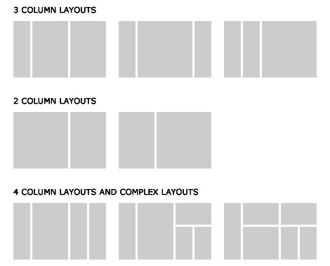
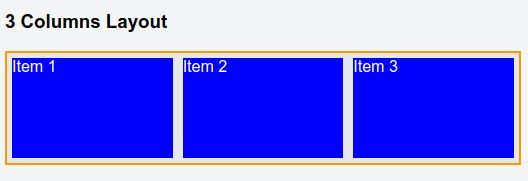
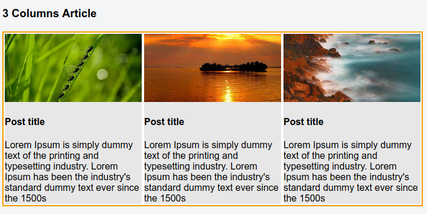
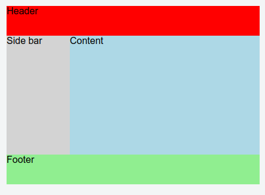
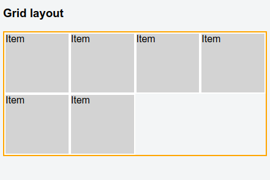
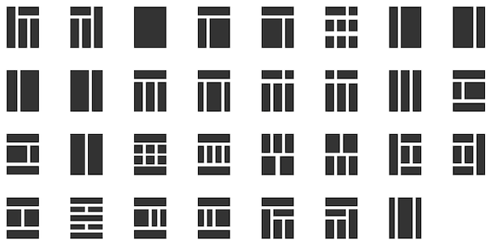
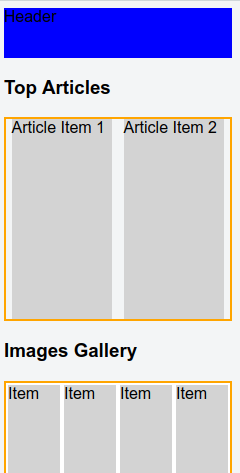
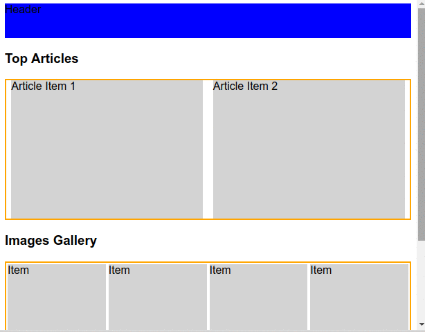

Trong bài học lần này mình sẽ hướng dẫn các bạn cách tạo ra bố cục (layout) dạng cột hoặc dạng lưới (grid) cho trang web.


layout dạng cột hoặc lưới gần như hiện diện ở khắp các trang web. Các Kỹ thuật liên quan bao gồm:

1) Display
2) Box-model
3) Dimention
4) Float và clearfix

Các phần này đã đề cập trong những bài học trước, nếu bạn chưa biết về nó thì nên xem lại nhé.

**Nguyên tắc chung của tạo bố cục cột (column) hoặc lưới (grid) bằng float là thiết lập chiều rộng cho phần tử rồi cho nó float**.

Tại sao mình lai nhấn mạnh là **float**, bởi vì hiện nay người ta đang dần khá chuộng cách layout website bằng kỹ thuật flexbox. Kỹ thuật này mình sẽ trình bày sau, trong bài học này mình chủ yếu nói về float, như là một kỹ thuật truyền thống vậy.


# 1. Bố cục dạng cột bằng float (Column layout with float)

Đầu tiên bạn nhìn hình dưới đây để hình dung bố cục dạng cột là như thế nào.



Như các bạn thấy, đa phần các trang web đều có ít nhất một phần nào đó trên trang theo bố cục dạng cột.

Tiếp theo, chúng ta sẽ thử tạo một bố cục dạng 3 cột đơn giản nhé.

**Ví dụ 1.1**: Giao diện ba cột đơn giản.


Đây là kết quả mà chúng ta mong muốn



Nhìn vào hình trên thì ý tưởng như sau, Tạo ra một container, sau đó tạo thêm 3 phần tử column, thiết lập chiều rộng rồi cho float về phía trái của container là xong. Tuy nhiên nhớ là khi float thì phải có clearfix.

Code mẫu như sau

Mã HTML

```html
<h3>3 Columns Layout</h3>
<div class="container">
  <!-- item -->
  <div class="column">
    <div class="simple-item">
      Item 1
    </div>
  </div>
  <!-- item -->

  <!-- item -->
  <div class="column">
    <div class="simple-item">
      Item 2
    </div>
  </div>
  <!-- item -->

  <!-- item -->
  <div class="column">
    <div class="simple-item">
      Item 3
    </div>
  </div>
  <!-- item -->
</div>
```

Mã CSS

```css
.container {
  border: 2px solid #FF9800;
  background-color: #E7E7E7;
}

.container::after {
  content: ".";
  visibility: hidden;
  display: block;
  height: 0;
  clear: both;
}

.column {
  width: 33.33333%;
  float: left;
}

.simple-item {
  height: 100px;
  background-color: blue;
  color: white;
  margin: 5px;
}
```

giá trị 33.33333% là lấy 100% chia cho 3. Ý là chia màn hình thành 3 cột.


**Ví dụ 1.2**: Giao diện ba cột đơn giản, áp dụng làm cho ba thẻ bài viết.

**Live DEMO**: [Ví dụ 1.2](https://jsfiddle.net/nghuuquyen/7tL0g4rw/)


Cái này là chỉnh lại một chút từ ví dụ 1 để nó trông thực tế hơn.Kết quả chúng ta mong muốn là như thế này.



Mã HTML

```html
<h3>3 Columns Article</h3>
<div class="container top-articles">
  <!-- item -->
  <div class="column">
    <div class="item">
      
      <h4>Post title</h4>
      <div>
        Lorem Ipsum is simply dummy text of the printing and typesetting industry. Lorem Ipsum has been the industry's standard dummy text ever since the 1500s
      </div>
    </div>
  </div>
  <!-- ./ item -->

  <!-- item -->
  <div class="column">
    <div class="item">
      
      <h4>Post title</h4>
      <div>
        Lorem Ipsum is simply dummy text of the printing and typesetting industry. Lorem Ipsum has been the industry's standard dummy text ever since the 1500s
      </div>
    </div>
  </div>
  <!-- ./ item -->

  <!-- item -->
  <div class="column">
    <div class="item">
      
      <h4>Post title</h4>
      <div>
        Lorem Ipsum is simply dummy text of the printing and typesetting industry. Lorem Ipsum has been the industry's standard dummy text ever since the 1500s
      </div>
    </div>
  </div>
  <!-- ./ item -->
</div>
```

Mã CSS

```css
.container {
  border: 2px solid #FF9800;
  background-color: #E7E7E7;
}

.container::after {
  content: ".";
  visibility: hidden;
  display: block;
  height: 0;
  clear: both;
}

.column {
  width: 33.33333%;
  float: left;
}

.top-articles {
  box-sizing: border-box;
}

.top-articles .item {
  box-sizing: border-box;
  border: 2px solid #FFF;
  width: 100%;
}

.top-articles .item img {
  width: 100%;
  max-height: 150;
}
```

**Ví dụ 1.3**: Giao diện website hai cột đơn giản

**Live DEMO**: [Ví dụ 1.4](https://jsfiddle.net/nghuuquyen/ts9ev0hw/)

Đây là kết quả chúng ta muốn làm



**Lưu ý** Trong ví dụ này có một điều đặc biệt đó là mình sử dụng `box-sizing`. Có một đặc điểm khi áp dụng layout float là bạn phải kiểm soát được chiều rộng định sẵn, chính vì vậy mình áp dụng `box-sizing: border-box` cho tất cả các phần tử.

Cách này cũng được **W3School** và **Bootstrap Framework** sử dụng.

Và mã lệnh của nó như sau

Mã HTML

```html
<div class="header">
  Header
</div>

<div class="page-container">
  <div class="sidebar">
    Side bar
  </div>
  <div class="content">
    Content
  </div>
</div>

<div class="footer">
  Footer
</div>
```

Mã CSS

```css
* {
  box-sizing: border-box;
}

.page-container::after {
  content: ".";
  visibility: hidden;
  display: block;
  height: 0;
  clear: both;
}

.header {
  height: 50px;
  background-color: red;
}

.sidebar {
  float: left;
  background-color: lightgray;
  height: 200px;
  width: 25%;
}

.content {
  float: right;
  height: 200px;
  background-color: lightblue;
  width: 75%;
}

.footer {
  height: 50px;
  background-color: lightgreen;
}
```


# 2. Bố cục dạng lưới bằng float (Grid layout with float)

Đầu tiên bạn xem hình dưới đây để hình dung như thế nào là grid layout.



Nó đơn giản là một tập các ô mà thôi. Layout dạng grid thường được áp dụng để trình bày ảnh, các thẻ bài viết, ... rất đang dạng.


Khi kết hợp grid layout và column layout, chúng ta sẽ có được nhiều giao diện website đẹp và linh hoạt, ví dụ như hình dưới đây.





Nào chúng ta cùng đi vào thử nghiệm tạo một grid layout đơn giản nhé.

**Ví dụ 2.1** Tạo grid layout đơn giản

Mục tiêu chúng ta là tạo được giao diện như sau.

**Live Demo**: [Ví dụ 2.1](https://jsfiddle.net/nghuuquyen/pbtuvez5/)


**Yêu cầu**: là thêm vào bao nhiều Item thì cũng sẽ tự động sắp xếp vào grid container.

**Ý tưởng**: Cách làm là bạn thiết lập chiều rộng cho các item rồi cho nó float về trái thôi.


Mã HTML

```html
<h3>Grid layout</h3>
<div class="grid-container">
  <div class="grid-item">
    Item
  </div>
  <div class="grid-item">
    Item
  </div>
  <div class="grid-item">
    Item
  </div>
  <div class="grid-item">
    Item
  </div>
  <div class="grid-item">
    Item
  </div>
  <div class="grid-item">
    Item
  </div>
</div>
```

Mã CSS

```css
* {
  box-sizing: border-box;
}
.grid-container {
  border: 2px solid orange;
}

.grid-container::after {
  content: ".";
  visibility: hidden;
  display: block;
  height: 0;
  clear: both;
}

.grid-container .grid-item {
  float: left;
  width: 25%;
  height: 100px;
  background-color: lightgray;
  border: 2px solid white;
}
```

# 3. Responsive layout cho điện thoại di động

Trong các ví dụ trên, khi nhìn ở màn hình desktop (màn hình lớn) thì sẽ khá ổn, tuy nhiên nếu xem bàng màn hình điện thoại (màn hình nhỏ) thì giao diện chia theo % như trên sẽ bị thu lại rất nhỏ gây bể giao diện hoặc rất khó nhìn. Ví dụ như hình dưới đây




Để khắc phục điều này chúng ta phải áp dụng kỹ thuật `Responsive` cụ thể là sử dụng `Media queries` của CSS. Kỹ thuật này mình sẽ trình bày sâu hơn ở bài học khác sau này. Tuy nhiên mình vẫn giới thiệu nó qua một ví dụ sau đây, để các bạn có một cái nhìn tổng quát hơn.


**Ví dụ 2.4** Xây dựng một website với layout responsive đơn giản


Kết quả chúng ta mong muốn chính là như thế này



Ta thấy là khi co giãn màn hình thì giao diện thay đổi theo. Khi ở màn hình đủ lớn thì sẽ hiển thị theo dạng cột hoặc grid bình thường, tuy nhiên khi màn hình nhỏ đi, thì sẽ hiển thị dạng ngang theo từng dòng.

Với cách trình bày ấy thì trên thiết bị màn hình nhỏ, sẽ dễ quan sát hơn nhiều.


Mã lệnh của ví dụ trên là như sau

Mã HTML

```html
<div class="header">
  Header
</div>

<div class="page-container">
  <h3>Top Articles</h3>
  <!-- top articles -->
  <div class="top-articles clearfix">
    <!-- column -->
    <div class="column">
      <div class="item">Article Item 1</div>
    </div>
    <!-- ./ column -->
    <!-- column -->
    <div class="column">
      <div class="item">Article Item 2</div>
    </div>
    <!-- ./ column -->
  </div>
  <!-- ./ top articles -->

  <h3>Images Gallery</h3>
  <div class="grid-container clearfix">
    <div class="grid-item">
      Item
    </div>
    <div class="grid-item">
      Item
    </div>
    <div class="grid-item">
      Item
    </div>
    <div class="grid-item">
      Item
    </div>
    <div class="grid-item">
      Item
    </div>
    <div class="grid-item">
      Item
    </div>
  </div>
</div>

<div class="footer">
  Footer
</div>
```


Mã CSS

```css
/* Base */

* {
  box-sizing: border-box;
}

.clearfix::after {
  content: ".";
  visibility: hidden;
  display: block;
  height: 0;
  clear: both;
}

/* Layout */

.header {
  height: 50px;
  background-color: blue;
}

.footer {
  height: 50px;
  background-color: lightgreen;
}

/* Top Articles */

.top-articles {
  border: 2px solid orange;
}

.top-articles .column {
  float: left;
  width: 50%;
}

.top-articles .item {
  background-color: lightgray;
  height: 200px;
  width: 95%;
  margin: 0 auto;
}

/* Image gallery */

.grid-container {
  border: 2px solid orange;
}

.grid-container .grid-item {
  float: left;
  width: 25%;
  height: 100px;
  background-color: lightgray;
  border: 2px solid white;
}

/* Media queries for responsive  */

@media (max-width: 600px) {
  .top-articles .column {
    width: 100%;
    margin: 5px auto;
  }
  .top-articles .item {
    width: 98%;
  }
  .grid-container .grid-item {
    width: 100%;
  }
}
```


Điều là nên giao diện responsive chính là ở đây

```css
@media (max-width: 600px) {
  .top-articles .column {
    width: 100%;
    margin: 5px auto;
  }
  .top-articles .item {
    width: 98%;
  }
  .grid-container .grid-item {
    width: 100%;
  }
}
```

Cái trên gọi là `css media queries`, câu lệnh trên đơn giản là nếu kích thước màn hình trong khoảng từ 0 đến tối đa là 600px thì hãy sử dụng những đoạn CSS sau.


Bạn để ý là mình thay đổi chiều rộng của `.top-articles .column` lên đến 100%.

```css
.top-articles .column {
  width: 100%;
  margin: 5px auto;
}
```

Khi kích thước màn hình thoát ra khỏi kích thước quy định trên media queries thì nó sẽ lấy kích thước của css quy định bên ngoài media queries. Là


```css
.top-articles .column {
  float: left;
  width: 50%;
}
```

**Thêm chút kiến thức về Media queries**

Media query sẽ vẫn kế thừa các thuộc tính của selector nhưng ưu tiên chọn các thuộc tính được định nghĩa trong media queries hơn nếu nó xảy ra.

Giả sử bạn có đoạn CSS như sau

```css
.column {
  width: 50%;
  background-color: blue;
}

@media (max-width: 600px) {
  .column {
    width: 100%;
  }
}
```

Thì lúc này nếu kích thước màn hình nhỏ hơn 600px thì `.column` sẽ có `width: 100%` tuy nhiên `background-color` vẫn giữ nguyên giá trị là `background-color: blue;`


Nghĩa là nó vẫn kế thừa các thuộc tính đã định nghĩa trước đó, **tuy nhiên nếu bạn thay đổi giá trị các thuộc tính đó bằng giá trị khác trong media query thì giá trị này sẽ được chọn.**


# Tác giả

**Name:** Nguyen Huu Quyen ( Nguyễn Hữu Quyền )

**Email:** nghuuquyen@gmail.com

**Website:** [Sociss Class - Online Education Center](https://sociss.edu.vn/)

**Profile Page:** [Nguyen Huu Quyen - Profile Page ](https://sociss.edu.vn/users/nghuuquyen)
