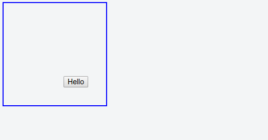
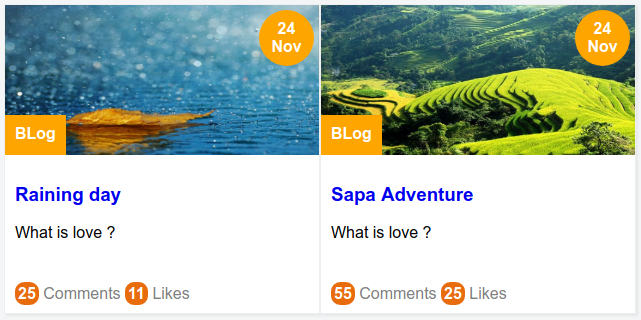

Trong các bài học lần trước các bạn đã biết về **float** giúp một phần tử trôi dạt theo hướng xác định, **Box model** giúp xác định khoảng các giữa các phần tử với nhau.

Trong bài học lần này mình sẽ trình bày về **position** là kỹ thuật xác định vị trí hiển thị của phần tử.


Trong CSS thuộc tính **position** cho phép xác định vị trí hiển thị phần tử, giá trị nhập vào bao gồm một trong các giá trị dưới đây.

**1) Static**

**2) Fixed**

**3) Relative và absolute**


## 1. Static

Trong CSS thì kiểu static là mặc định, có thể hiểu là không được định vị trí.

Vậy nói đơn giản nếu bạn thiết lập `position : static` cho phần tử thì sẽ chẵng có hiệu ứng gì xảy ra hết, phần tử sẽ hiển thị đúng theo cách nó nên được hiển thị.


## 2. Fixed

Đây là kiểu hiển thị cố định vị trí so với **viewport** có nghĩa là nó luôn luôn ở cùng một vị trí khi cuộn trang. **Viewport** ở đây chính là khung nhìn màn hình của các bạn.


Ví dụ ngay ở trang Sociss Class của mình, hộp chia sẽ được thiết lập `position : fixed` nên nó sẽ vẫn giữ nguyên vị trí khi bạn cuộn trang. Gây cảm giác cho bạn là nó đang trôi theo tuy nhiên thực chất là nó chỉ giữ nguyên vị trí của mình.

Các tham số  `top, right, bottom, left` sẽ xác định khoảng các của phần tử đó đến các cạnh của viewport. Đơn vị có thể là px, em, pt, ...

**Ứng dụng**

+ Thường sử dụng cho header hoặc footer để giữ cho các nút tiện ích cố định mang lại sự tiện dụng cho người dùng.

+ Các quảng cáo ở gốc hoặc các nút tiện ích cầ n sử dụng liên tục.


**Ví dụ 2.1** : Áp dụng position fixed cho header trôi theo khi cuộn trang.


Live Demo: [Ex 2.1 Header position fixed demo](https://jsfiddle.net/nghuuquyen/ab5h73fm/)

```html
<div class="page-wapper">
  <header id="header">
    <nav>
      <a href="/#">Home</a>
      <a href="/#">Contact</a>
    </nav>
  </header>

  <div id="page-content">
    Page content.
  </div>
</div>
```

Mã CSS

```css
/* CSS Reset */

* {
  margin: 0;
}

#header {
  position: fixed;
  top: 0;
  height: 50px;
  width: 100%;
  background: lightgray;
}

#page-content {
  margin-top: 60px;
  height: 500px;
  width: 90%;
  border: 1px solid blue;
  margin-left: auto;
  margin-right: auto;
}
```

Trong ví dụ trên các bạn để ý trong `#page-content` mình có `margin-top: 60px` vì khi một phần tử ở dạng fixed nó sẽ trở nên lơ lửng, và các phần tử khác có thể chui vào bên dưới nó (bị header che mất). Nên giá trị `margin-top: 60px` là để tạo ra một khoảng cách so với header, tránh việc nội dung trang bị che bởi header.


**Lưu ý khi sử dụng position fixed**

Position Fixed không hiển thị tốt cho tất cả các dòng máy khác hoặc trên các trình duyệt đời cũ. Nên bạn phải cân nhắc khi sử dụng tính năng này nếu bạn muốn website của bạn chạy tốt ở những loại máy tầm 5 hay 6 năm về trước nhé.


Bạn có thể đọc qua bài viết này [Mobile fixed position problem and solution](http://bradfrost.com/blog/mobile/fixed-position/)


**Mình sẽ tóm tắt nội dung như sau**

+ Trên các trình duyệt cũ hoặc trên các dòng máy đời cũ thì postion: fixed hoặc động không ổn định, khá chậm có dòng máy thì không chạy được hoặc yêu cầu phải tắt chế độ phóng (Zoom).

+ Nếu bạn thiết lập cho phép Zoom (dùng hai ngón tay thu nhỏ hoặc phóng to màn hình) thì postion: fixed sẽ không hoạt động nữa.

+ Giải pháp cho vấn đề trên thì người ta đề xuất dùng thêm Javascript để kiểm tra và hỗ trợ.


## 3. Relative và Absolute

Đây là hai giá trị position riêng biệt nhưng chỉ phát huy hiệu quả nếu đi cặp với nhau.

**Đầu tiên mình sẽ có một ví dụ minh họa nhỏ. Giả sử bạn cần xác định vị trí nào đó gần bạn và bạn đặt câu hỏi như sau:**

>Hãy giúp mình xác định vị trí cách tôi 2 km về hướng Đông ?

--> Với câu hỏi như trên thì không ai trả lời được vì họ không biết bạn đang ở đâu. Nhưng nếu bạn hỏi:

>Hãy giúp mình xác định vị trí cách tôi 2 km về hướng Đông, lúc này mình đang ở đường Trần Phú, thành phố Đà Nẵng ?

--> Với câu hỏi này thì người ta có thể trả lời được, **vì có một cột mốc cụ thể**.


**Trong CSS cũng vậy, thành phần có position `Relative` giống như cột mốc cho thành phần có position `Absolute` canh chỉnh theo.**


**Có một yêu cầu** đó là thành phần có position absolute **phải nằm ở bên trong** thành phần có position relative, thì khi đó việc canh chỉnh mới chính xác được.

Nếu bạn không đảm bảo quy tắc trên, bỏ qua thiết lập `Relative` cho phần tử chứa thì giao diện sẽ không dự đoán được, **vì nó sẽ tự đi tìm phần tử chứa mình có thiết lập `Relative` hoặc nếu tìm không ra thì sẽ chọn viewport, điều đó dẫn đến phần tử đó sẽ di chuyển khi theo khi bạn cuộn trang**.


Vị trí của một phần tử kiểu `Absolute` được xác định dựa vào bốn tham số `top, right, bottom và left` lần lượt đó chính là khoảng cách đến viền trong của phần tử chứa được thiết lập `Relative`. Để hiểu rõ hơn hay xem ví dụ bên dưới.

**Ví dụ 3.1** : Áp dụng position Relative và Absolute thiết lập cho nút nhấn cách cạnh dưới 35px và cạnh phải 35px.

Trong ví dụ này nếu các bạn không biết về kỹ thuật **position** thì các bạn phải làm rất phức tạp bằng kỹ thuật **float**, **box model** và **dimention**.

Tuy nhiên với kỹ thuật **position** thì vấn đề sẽ giải quyết như sau.

Mã HTML

```html
<div class="container">
  <div class="item">
    <button>
      Hello
    </button>
  </div>
</div>
```

Mã CSS

```css
.container {
  border: 2px solid blue;
  width: 200px;
  height: 200px;
  position: relative;
}

.item button {
  position: absolute;
  right: 35px;
  bottom: 35px;
}
```

Và kết quả là

Live Demo: [Ex 1-3](https://jsfiddle.net/nghuuquyen/ve4v6dhf/)




Rất đơn giản đúng không nào.


## 4. Thực hành sử dụng Relative và Absolute

Tiếp theo chúng ta sẽ có một bài thực hành nhỏ, để hiểu rõ hơn tại sao position relative và absolute lại quan trọng.

Trong bài thực hành này chúng ta sẽ làm một sản phẩm nhỏ như sau.




Các bạn xem code chạy thật ở link dưới nhé.

Live Demo: [Demo thẻ bài viết](https://jsfiddle.net/nghuuquyen/q28bsua8/)


Nhìn sơ qua, chúng ta sẽ thấy ngay bố cục trình bày của thẻ trên khá phức tạp, nếu áp dụng float hoặc box model cho các thành phần nhỏ ở thẻ trên thì sẽ gặp nhiều khó khăn, tuy nhiên nếu áp dụng Relative và Absolute thì sẽ rất đơn giản. Nào chúng ta cùng làm.

Đầu tiên tạo nên cấu trúc mã HTML cho thẻ ở trên dựa vào hình thì sẽ được như thế này.

```html
<!-- card -->
<div class="qt-card">
  <div class="card-header">
    <span class="time">24 Nov</span>
    
    <span class="categories">BLog</span>
  </div>
  <div class="card-body">
    <h3><a href="#">Raining day</a></h3>
    <p>
      What is love ?
    </p>
  </div>

  <div class="card-footer">
    <div class="card-statis">
      <a href="#">
        <span>25</span> Comments
      </a>
      <a href="#">
        <span>11</span> Likes
      </a>
    </div>
  </div>
</div>
<!-- ./ card -->
```

Cách chia cấu trúc HTML cho thẻ thì **tùy các bạn**, tuy nhiên mình thì thường chia thành 3 phần , header, body và footer. Sau đó trong mỗi phần mình xác định các thành phần con trong đó rồi đặt tên cho chúng. Và cuối cùng mình có được như trên.

**Ghi chú**: Các bạn nên đặt tên các class sao cho thật dễ hiểu và dễ nhớ nhé.

Tiếp theo là đến phần CSS.

Thì theo hướng tiếp cận SMACSS (Scalable and Modular Architecture for CSS) các nguyên tắc này mình sẽ trình bày kỹ hơn về sau tuy nhiên cách thực hành sẽ như thế này.

Đầu tiên định nghĩa trước CSS cho phần layout (bố cục) và phần cơ sở (base). Trong đó `layout` đại diện cho cách các phần tử được trình bày còn Base là những định nghĩa chung cho toàn bộ các phần tử.

```css
/* Layout */

.row {
  background-color: #EEE;
}

.col {
  float: left;
  width: 50%;
}

/* Base */
a {
  text-decoration: none;
}
```

Như trên mình dự định trình bày thẻ trên một bố cụ dạng cột, và mình muốn tất cả thẻ `a` đều không gạch chân dưới.

Tiếp theo là CSS cho thành phần Card. Theo hướng tiếp cận OOCSS (Object Oriented CSS) về hướng tiếp cận này mình cũng sẽ nói cụ thể trong các bài học sau. Tuy nhiên trong thực hành nó sẽ như thế này.

Định nghĩa CSS cho các class từ cao nhất cho đến thấp nhất theo đúng thứ tự.

Cụ thể là .qt-card --> .card-header --> .card-body --> .card-body

Trong .card-header thì theo thứ tư như sau

.card-header --> .time --> img --> .categories

Nếu các bạn tuân thủ nguyên tắc viết như thế này, thì mã lệnh của các bạn sẽ vô cùng đẹp, thứ hai việc bảo trình sau này sẽ rất tiện và mạch logic suy nghĩ trong đầu cũng rất tự nhiên.


Và CSS của thành phần Card sẽ như sau. Phân tích từng phần sẽ ở bên dưới nhé.


```css
/* Component: Card */

.qt-card {
  background-color: white;
  border: 1px solid #EEE;
  box-shadow: 2px 2px 2px #E7E7E7;
}

.qt-card {
  max-width: 350px;
  min-width: 200px;
}

.qt-card .card-header {
  position: relative;
  height: 150px;
  overflow: hidden;
}

.qt-card .card-header img {
  /* equals to min-width of card */
  min-width: 200px;
  display: block;
  width: 100%;
  height: 100%;
}

.qt-card .card-header .time {
  position: absolute;
  right: 5px;
  top: 5px;
  background-color: orange;
  padding: 10px;
  border-radius: 50%;
  width: 35px;
  word-break: break-word;
  text-align: center;
  color: white;
  font-weight: 600;
  overflow: hidden;
}

.qt-card .card-header .categories {
  background-color: orange;
  position: absolute;
  height: 20px;
  bottom: 0;
  left: 0;
  padding: 10px;
  color: white;
  font-weight: 600;
}

.qt-card .card-body {
  padding: 10px;
  height: 100px;
}

.qt-card .card-body h3 {
  overflow: hidden;
  text-overflow: ellipsis;
  white-space: nowrap;
}

.qt-card .card-body p {
  overflow: hidden;
  text-overflow: ellipsis;
  -webkit-line-clamp: 2;
  display: -webkit-box;
  -webkit-box-orient: vertical;
}

.qt-card .card-footer {
  padding: 10px;
}

.qt-card .card-footer .card-statis a {
  text-decoration: none;
  color: gray;
}

.qt-card .card-footer .card-statis a span {
  background-color: #E86B0C;
  padding: 3px;
  color: white;
  font-weight: bold;
  border-radius: 40%;
}
```

Đầu tiên là CSS cho phần khung chứa. Trong phần này các bạn để ý là một card khi thể phình to ra mãi được vì như vậy giao diện sẽ mất kiểm soát thứ hai nó cũng không thể quá nhỏ khi màn hình bị co lại trên mobile thì cũng khá tệ.

Chính vì vậy mình xử lý bằng max-width và min-width như bên dưới.

```css
.qt-card {
  background-color: white;
  border: 1px solid #EEE;
  box-shadow: 2px 2px 2px #E7E7E7;
}

.qt-card {
  max-width: 350px;
  min-width: 200px;
}
```


Tiếp theo là phần card-header. Các bạn thấy rằng ý tưởng sẽ cho hai thành phần con là time và categories nhảy về góc phải trên và góc trái dưới.

Để làm được điều này mình thiết lập cho .card-header position là relative. Sau đó phần tử time và categories trong card-header sẽ có position là absolute. Sau đó lần lượt thiết lập các tham số `top right bottom left` cho time và categories thì được kết quả mong muốn.

**Mẹo** : Trong thẻ img ở phần header mình thiết lập min-width bằng với giá trị min-width của card vì như vậy trên mobile nó sẽ hiển thị tốt hơn, không bị quá nhỏ.

Thứ hai lưu ý về tỉ lệ hình ảnh, trong thiết kế trên, mình thiết kế ảnh kích thước là 150x300px chính vì vậy để hình ảnh đẹp nhất, **các bạn phải nói các lập trình viên phía server side (backend) bảo đảm kích thước ảnh ít nhất phải lớn hơn hoặc bằng kích thước 150x300px nếu không hình ảnh có thể sẽ bị kéo dãn**.

Đây là đoạn CSS xử lý ảnh của mình, mình để `height 100%` thí sẽ dẫn đến hình ảnh
bị kéo căng ra khi kích thước nhỏ hơn 150px, tuy nhiên như vậy vẫn tốt nếu ai đó bất cẩn thì
trong giao diện bạn vẫn nhìn ổn.


```css
.qt-card .card-header img {
  /* equals to min-width of card */
  min-width: 200px;
  display: block;
  width: 100%;

  /* This line will make image stretch but we will got good UI than put it auto */
  height: 100%;
}
```


Tóm lại CSS cho phần card-header sẽ như sau.

```css
.qt-card .card-header {
  position: relative;
  height: 150px;
  overflow: hidden;
}

.qt-card .card-header img {
  /* equals to min-width of card */
  min-width: 200px;
  display: block;
  width: 100%;

  /* This line will make image stretch but we will got good UI than put it auto */
  height: 100%;
}

.qt-card .card-header .time {
  position: absolute;
  right: 5px;
  top: 5px;
  ...
}

.qt-card .card-header .categories {
  position: absolute;
  bottom: 0;
  left: 0;
  ...
}
```

Tiếp theo là phần card-body. Trong phần này các bạn lưu ý vấn đề tràn chữ trong phần tiêu đề và phần mô tả.

Cụ thể là các bạn luôn phải chú ý rằng, các đoạn text thì nó có độ dài tùy ý, chính vì vậy khi viết mã CSS chúng ta phải tính toán trước trường hợp này để phòng, nếu không lỡ sau này có nội dung nào đó dài quá hoặc ngắn quá thì cũng sẽ gây bể giao diện không đáng có .

Thì để khắc phục điều này đầu tiên mình sẽ định trước luôn chiều cao của card-body là 100px, nhờ vậy dù có chữ hay không thì nó vẫn vậy chiều cao đã được định sẵn và không gây ảnh hưởng đến các thành phần khác.

Thứ hai, đối với thẻ h3 và p thì mình xác định thuộc tính `text-overflow` để khi text vượt quá thì sẽ hiển thị dấu 3 chấm (...).

Đặc biệt trong thẻ p mình áp dụng `webkit-line-clamp` để xác định số dòng tối đa cho phép, cụ thể mình để là 2. Nghĩa là trong phần mô tả nếu nhiều hơn hai dòng, thì phần dư ra sẽ thành dấu 3 chấm (...) rất tiện đúng khộng nào.

**Mẹo**: Vấn đề xử lý tràn chữ là chuyện muôn thuở khi làm web, thường thì các front-end dev sẽ dùng thêm Javascript hoặc ở server side sẽ tính toán và cắt trước đoạn chữ cho phù hợp rồi mới trả dữ liệu về.

**Vì sao lại làm vậy ?**

Nguyên nhân là vì CSS có thể không chạy tốt ở một số trình duyệt cũ, đặc biệt là trên IE.


Và đây là code CSS của mình cho giải pháp trên.

```css
.qt-card .card-body {
  padding: 10px;
  height: 100px;
}

.qt-card .card-body h3 {
  overflow: hidden;
  text-overflow: ellipsis;
  white-space: nowrap;
}

.qt-card .card-body p {
  overflow: hidden;
  text-overflow: ellipsis;
  -webkit-line-clamp: 2;
  display: -webkit-box;
  -webkit-box-orient: vertical;
}
```

Còn phần card-footer thì khá đơn giản, nên mình không giải thích nhé.

Cuối cùng để thân thiện trên mobile, thì mình sẽ dùng thêm một đoạn code media query sau. Đơn giản là để cho thẻ có thể hiển thị full màn hình.

```css
@media screen and (max-width: 500px) {
  .qt-card {
    min-width: 100%;
  }

  .qt-card .card-header {
    /* height auto for best scale image on mobile. */
    height: auto;
    max-height: 150px;
  }

  .col {
    width: 100%;
  }
}
```

Live Demo: [Demo thẻ bài viết](https://jsfiddle.net/nghuuquyen/q28bsua8/)


## Nhận xét và kết luận

Tới đây các bạn sẽ hỏi mình, **vậy khi nào nên dùng position relative và absolute và khi nào thì nên dùng float, box model, dimention ?**


**Các kỹ thuật float và box model chủ yếu dùng để tạo bố cục trang web (layout)**, Float thì dùng để chia cột hoặc tạo grid, trong khi đó box model và dimention thì dùng để xác đinh khoảng cách và kích thước khi trình bày các phần tử vào từng cột.

Còn kỹ thuật xác định vị trí (position) dùng để trình bày các phần tử. Như là đặt phần tử ở góc trái trên, ở giữa hay cách góc một khoảng nào đó, v.v . Thường là những chi tiết vụn vặt rất phức tạp.

Nếu các bạn áp dụng kỹ thuật tạo bố cục (layout) và để trình bày những chi tiết vụn vặt phức tạp thì sẽ gặp rất nhiều khó khăn trong khi viết mã. Điều này thì các bạn chỉ cần thử đặt vấn đề ra và thử giải quyết là hiểu ngay.

**Ví dụ**: Các bạn thử chia cột bằng  position hoặc tạo một user card phức tạo như trên chỉ bằng float và box model. **Cái gì dùng sai mục đích thì sẽ khó khăn vô cùng đúng không nào**.

**Thứ hai** qua phần thực hành nhỏ ở mục 4 trong bài học này, mình muốn nhắc các bạn khi viết mã CSS, **thì luôn phải dự tính trường hợp dữ liệu thực sau này không `đẹp` như trong thiết kế**.

Ví dụ có thể **tiêu đề quá dài**, quá ngắn hoặc không có, hình ảnh quá nhỏ, quá to hoặc **không có hình ảnh**. Tại vì dữ liệu này được trả từ server về nên nhiều khi sẽ gặp lỗi hoặc không như ý muốn. Chính vị vậy khi viết mã phải dự tính trước, **luôn xác định các tham số max, min hoặc đặt giá trị width height cố định nếu cần thiết để tránh sự cố bể giao diện xảy ra**.


## Tác giả

**Name:** Nguyễn Hữu Quyền ( Quyen Nguyen Huu )

**Email:** nghuuquyen@gmail.com

**Website:** [Sociss Class - Online Education Center](https://sociss.edu.vn/)

**Profile Page:** [Nguyen Huu Quyen - Profile Page ](https://sociss.edu.vn/users/nghuuquyen)
