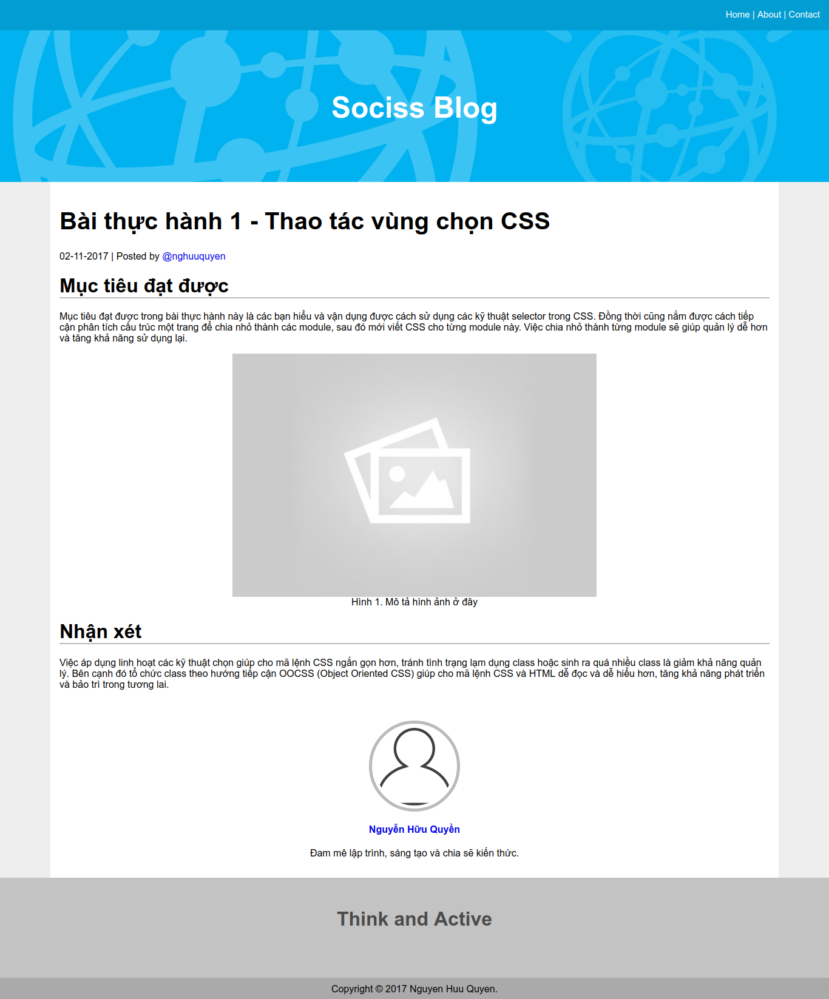

# Bài này là bài thực hành của bài học số 3 CSS - Selector

Mục tiêu đạt được trong bài thực hành này là các bạn hiểu và vận dụng được
cách sử dụng các kỹ thuật selector trong CSS. Đồng thời cũng nắm được cách tiếp cận phân
tích cấu trúc một trang để chia nhỏ thành các module, sau đó mới viết CSS cho từng module này.
Việc chia nhỏ thành từng module sẽ giúp quản lý dễ hơn và tăng khả năng sử dụng lại.


Đây là yêu cầu của bài thực hành, hãy viết code CSS để có được giao diện như hình bên dưới.




# Bước 0. Chuẩn bị cho thực hành

Tạo ra hai file index.html và style.css.
Tạo thư mục images/ và bỏ vào đây ảnh bạn thích.

Trong file index.html thì copy nội dung ở dưới đây bỏ vào. Sau đó mở file style.css lên và tiến hành thực hành.


```html
<!DOCTYPE html>
<html>
<head>
  <meta charset="utf-8">
  <title>Bài thực hành số 1 - CSS Selector | Sociss Class - Online Education Center</title>
  <link rel="stylesheet" href="./style.css">
</head>
<body>
  <!--  header-->
  <div class="header">
    <nav class="header-navbar">
      <a href="/">Home</a> |
      <a href="/services"> About</a> |
      <a href="/services"> Contact</a>
    </nav>

    <div class="header-banner">
      <h1>Sociss Blog</h1>
    </div>
  </div>
  <!-- ./ header -->

  <!-- page content -->
  <div class="page-wrap">
    <div class="container">
      <!-- post -->
      <div class="post">
        <!-- post title -->
        <div class="post-title">
          <h1>Bài thực hành 1 - Thao tác vùng chọn CSS</h1>
          02-11-2017 | Posted by <a href="/nghuuquyen">@nghuuquyen</a>
        </div>
        <!-- ./ post title -->

        <!-- post content -->
        <div class="post-content">
          <h1>Mục tiêu đạt được</h1>
          <p>
            Mục tiêu đạt được trong bài thực hành này là các bạn hiểu và vận dụng được
            cách sử dụng các kỹ thuật selector trong CSS. Đồng thời cũng nắm được cách tiếp cận phân
            tích cấu trúc một trang để chia nhỏ thành các module, sau đó mới viết CSS cho từng module này.
            Việc chia nhỏ thành từng module sẽ giúp quản lý dễ hơn và tăng khả năng sử dụng lại.
          </p>

          <figure>
            </img>
            <figcaption>Hình 1. Mô tả hình ảnh ở đây</figcaption>
          </figure>

          <h1>Nhận xét</h1>
          <p>
            class hoặc sinh ra quá nhiều class là giảm khả năng quản lý. Bên cạnh đó tổ chức class
            theo hướng tiếp cận OOCSS (Object Oriented CSS) giúp cho mã lệnh CSS và HTML dễ đọc và dễ hiểu hơn,
            tăng khả năng phát triển và bảo trì trong tương lai.
          </p>
        </div>
        <!-- ./ post content -->

        <!-- post author -->
        <div class="post-author">
          </img>
          <h4><a href="#">Nguyễn Hữu Quyền</a></h4>
          <p>
            Đam mê lập trình, sáng tạo và chia sẽ kiến thức.
          </p>
        </div>
        <!-- ./ post author -->
      </div>
      <!-- ./ post -->
    </div>
  </div>
  <!-- ./ page content -->

  <!-- footer -->
  <footer class="footer">
    <!-- subscribe form -->
    <h1>Think and <b>Active</b></h1>

    <!-- bottom -->
    <div class="footer-bottom">
      Copyright © 2017 Nguyen Huu Quyen.
    </div>
    <!-- ./ bottom -->
  </footer>
  <!-- ./ footer -->
</body>
</html>
```

Phần mã HTML chuẩn bị trước cho bài thực hành. Vì bài học này chỉ rèn CSS các bạn không cần tự viết HTML.


# Bước 1. Phân tích cấu trúc trang

Đầu tiên từ file index.html ta phân tích được cấu trúc dạng đối tượng như dưới đây.


```sh
--header
---- header-navbar
---- header-banner

--page-content
----container
------post
--------post-title
--------post-content
--------post-author

--footer
----footer-bottom
```

Sau khi đã phân tích ra thì chúng ta đã xác định được 3 đối tượng chính trên trang bao gồm:

1) header
3) post
3) footer

Bước tiếp theo chúng ta sẽ viết lần lượt CSS cho từng đối tượng này.


# Bước 2. Định nghĩa CSS nền và layout cho trang

Nguyên tắc viết CSS là bạn không lao vào định nghĩa cái chi tiết ngay mà đầu tiên phải định nghĩa những cái tổng quá trước. Hai cái đó bao gồm:

1) **Base** : phần cơ sở thường là màu chữ và font chữ cho toàn trang.
2) **Layout** : là cấu trúc các khối trong trang như là footer, header và page content.


## Bước 2.1 Định nghĩa phần Base CSS

đầu tiên mình xác định các phông chữ trong trang web này, thì thấy là có hai phông chữ khác nhau.

Phông chữ cho phần header và footer theo yêu cầu là phông chữ **Arial**.
Còn phần bài viết là **Roboto**.

Kế theo đó là trong trang web mình không muốn link bị gạch chân.

Bạn thêm vào file style.css đoạn mã dưới đây.

```css
/**
* Base
* ----------------------------------
* Define font color, font family, ...
*/

header, footer {
  font-family: Arial, Helvetica, sans-serif;
}

.post {
  font-family: "Roboto", serif;
}

a {
  text-decoration: none;
}
```

## Bước 2.2 Định nghĩa phần layout CSS

Trong phần layout thì sẽ định nghĩa màu sắc chủ đạo của trang và kích cỡ các thành phần.

Bạn thêm vào file style.css đoạn mã dưới đây.

```css
/**
* Layout
* ----------------------------------
* Define size and color of main sections in website
*/

body {
  background-color: #EEE;
}

.container {
  display: block;
  clear: both;
  padding: 15px;
}

.page-wrap {
  background-color: #FFF;
  max-width: 1200px;
  margin: 0 auto;
}
```

Tới đây là bạn đã định nghĩa xong phần chung của trang, tiếp theo là đi vào chi tiết từng module nhỏ trong trang.

# Bước 3. Định nghĩa CSS cho từng phần trong trang

Trong trang web này thì ở bước 1 phân tích ta đã xác định được các đối tượng hay module chính trong trang đó là:

1) header
3) post
3) footer

Ta sẽ lần lượt đi vào định nghĩa cho từng module một.

## Bước 3.1 CSS cho phần header

Đối với phần header thì ta thấy nó gồm hai thành phần là banner và navbar.
Trong phần header-banner thì có phần text là thẻ h1 nên dùng kỹ thuật chọn phần tử con trực tiếp (>) là hợp lý nhất.


```css
/**
* Module: header
* ----------------------------------
*/
.header {
  /* 300px = 250px of banner + 50px of navbar */
  min-height: 300px;
}

.header-navbar {
  text-align: right;
  height: 50px;
  background: #029dd2;
  color : white;
  font-size: 15px;
  padding: 15px;
  box-sizing: border-box;
}

.header-navbar a {
  text-decoration: none;
  color: white;
}

.header-banner {
  min-height: 250px;
  background: url('./images/header-banner.png') no-repeat center center;
  background-size: cover;
  -webkit-background-size: cover;
  -moz-background-size: cover;
  -o-background-size: cover;
}

.header-banner > h1 {
  text-align: center;
  padding-top: 100px;
  margin: 0;
  color: #FFF;
  font-size: 3em;
}
```

## Bước 3.2 CSS cho phần post

Đối với phần header thì ta thấy nó gồm ba thành phần là post-title, post-content và post-author.

Trong đó để ý là các thẻ h1 của post-content đều được gạch chân, còn hình ảnh thì được căn giữa.

Một chút lưu ý là vì chiều rộng tối đa của trang là 1200px, nên để hình ảnh nhìn đẹp và cân đối thì chỉ cho phép hình ảnh bài viết có chiều ngang lớn nhất là 600px.

```css
/**
* Module: post
* ----------------------------------
*/
.post-title > h1 {
  font-size: 2.5em;
}

.post-content h1 {
  border-bottom: 2px solid #BBB;
}

.post-content img {
  width: 100%;
  max-width: 600px;
  height: auto;
  margin-left: auto;
  margin-right: auto;
  display: block;
}

.post-content figure {
  text-align: center;
}

.post-author {
  margin-top: 50px;
  text-align: center;
}

.post-author img {
  width: 150px;
  height: 150px;
  border: 5px solid #BBB;
  border-radius: 50%;
  box-sizing: border-box;
  padding: 5px;
  margin: 0 auto;
  display: block;
}
```

## Bước 3.3 CSS cho phần footer

Trong phần css ở footer thì mình áp dụng kỹ thuật position cho phần **footer-bottom** để cho phần này luôn luôn ở dưới cùng của footer.


```css
/**
* Module: footer
* ----------------------------------
*/

.footer {
  background-color: #C3C3C3;
  position: relative;
  min-height: 200px;
}

.footer > h1 {
  color: #4B4B4B;
  text-align: center;
  padding: 50px;
  margin: 0;
}

.footer .footer-bottom {
  bottom: 0;
  position: absolute;
  width: 100%;
  height: 35px;
  padding: 10px;
  background-color: #AAA;
  text-align: center;
  box-sizing: border-box;
}
```


Đến đây là xong rồi, các bạn đã hòan tất bài thực hành số 1.

# Nhận xét

Việc áp dụng linh hoạt các kỹ thuật chọn giúp cho mã lệnh CSS ngắn gọn hơn, tránh tình trạng lạm dụng
class hoặc sinh ra quá nhiều class là giảm khả năng quản lý. Bên cạnh đó tổ chức class
theo hướng tiếp cận OOCSS (Object Oriented CSS) giúp cho mã lệnh CSS và HTML dễ đọc và dễ hiểu hơn,
tăng khả năng phát triển và bảo trì trong tương lai.

Ngoài ra các bạn để ý là hầu như mình không sử dụng cách chọn theo ID, vì thực ra nếu tổ chức CSS theo ID thì rất là khó hiểu và khó sử dụng lại.


# Tác giả

**Name:** Nguyen Huu Quyen ( Nguyễn Hữu Quyền )

**Email:** nghuuquyen@gmail.com

**Website:** [Sociss Class - Online Education Center](https://sociss.edu.vn/)

**Profile Page:** [Nguyen Huu Quyen - Profile Page ](https://sociss.edu.vn/users/nghuuquyen)
