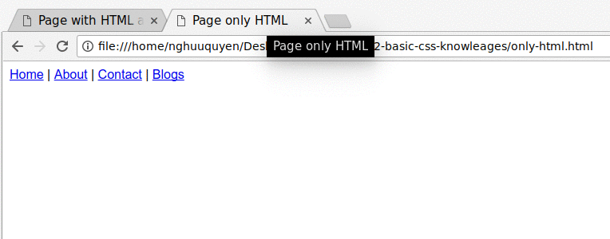

CSS là viết tắt của cụm từ Cascading Style Sheet, là một ngôn ngữ được sử dụng để định dạng màu sắc, vị trí, cách thức hiển thị cho các phần tử trong trang HTML. Giúp trang HTML trở nên bắt mắt, truyền tải được nội dung rõ ràng và sinh động hơn.


Nói một cách dễ hiểu hơn, HTML đóng vai trò như là vật liệu để xây dựng lên trang web, trong khi đó CSS đóng vai trò trang trí. Giúp cho trang HTML trở nên đẹp hơn.

Bạn xem hình ví dụ dưới đây để thấy sự khác biệt khi chỉ dùng HTML và khi có CSS kết hợp vào.




Code ví dụ trên là như dưới đây.

Khi chỉ có HTML thôi.

```html
<!DOCTYPE html>
<html>
<head>
  <meta charset="utf-8">
  <title>Page only HTML</title>
</head>
<body>
  <nav>
    <a href="#">Home</a> |
    <a href="#">About</a> |
    <a href="#">Contact</a> |
    <a href="#">Blogs</a>
  </nav>
</body>
</html>
```

Khi có CSS vào

```html
<!DOCTYPE html>
<html>
<head>
  <meta charset="utf-8">
  <title>Page with HTML and CSS</title>
  <!-- CSS code -->
  <style>
  .navbar {
    padding: 15px;
    background: DodgerBlue;
    color: #FFF;
  }

  .nav-item {
    color: #FFF;
    text-decoration: none;
  }
  </style>
  <!-- ./ CSS -->
</head>
<body>
  <nav class="navbar">
    <a class="nav-item" href="#">Home</a> |
    <a class="nav-item" href="#">About</a> |
    <a class="nav-item" href="#">Contact</a> |
    <a class="nav-item" href="#">Blogs</a>
  </nav>
</body>
</html>
```

Trong bài giới thiệu lần này các bạn chỉ cần hiểu CSS là gì, khi sử dụng nó thì có hiệu quả ra sao mà thôi. Trong bài học tới mình sẽ trình bày cụ thể hơn về những cái cần biết khi làm việc với CSS.


## Tác giả

**Name:** Nguyễn Hữu Quyền ( Quyen Nguyen Huu )

**Email:** nghuuquyen@gmail.com

**Website:** [Sociss Class - Online Education Center](https://sociss.edu.vn/)

**Profile Page:** [Nguyen Huu Quyen - Profile Page ](https://sociss.edu.vn/users/nghuuquyen)
