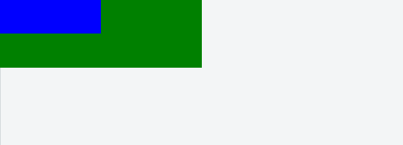

Trong bài học lần này chúng ta sẽ tìm hiểu về làm việc với kích thước (dimention). Đơn giản là thiết lập chiều ngang (width) và chiều cao (height) cho một phần tử HTML.

# 1. width (chiều rộng) và height (chiều cao)

Trong CSS có hai kỹ thuật thiết lập kích thước đó là:

1) Thiết lập cứng kích thước (không thể  thay đổi)

2) Thiết lập kích thước theo tỉ lệ % kích thước của phần tử chứa. Dẫn đến nếu kích thước của phần tử chưa thay đổi thì phần tử con cũng bị thay đổi theo.

**Ví dụ 1** Thiết lập thẻ div có kích thước cứng là 200px

```css
div {
  width: 200px;
  height: 50px;
  background-color: green;
}
```

Lúc này dùng kích thước trên là cố định không thể thay đổi.


**ví dụ 2** Thiết lập thẻ div có kích thước là một nửa màn hình.

```css
div.content {
  width : 50%;
  height: 50px;
  background-color: green;
}
```

```html
<!DOCTYPE html>
<html>
<head>
  <meta charset="utf-8">
  <title>Demo</title>
</head>
<body>
  <div class="content"></div>
</body>
</html>
```
Lúc này bạn thử co giãn màn hình thì sẽ thấy thẻ div co giãn theo. Vì nó sẽ lấy độ rộng là 50% độ rộng của phần tử chứa, trong ví dụ này là thẻ body.

**ví dụ 2** Thiết lập thẻ div.box có kích thước là một nửa của div.container




Mã HTML

```html
<!DOCTYPE html>
<html>
<head>
  <meta charset="utf-8">
  <title>Demo</title>
</head>
<body>
  <div class="container">
    <div class="box"></div>
  </div>
</body>
</html>
```

Và mã lệnh CSS

```css
div.container {
  width : 50%;
  height: 100px;
  background-color: green;
}

div.box {
  width : 50%;
  height: 50px;
  background-color: blue;
}
```

# 2. max-width (chiều rộng tối đa) và max-height (chiều cao tối đa)

Thiết lập cứng kích thước chiều ngang có thể gặp hạn chế trong một số trường hợp, ví dụ như là hiển thị ảnh chẵng hạn. Vì giả sử bạn thiết lập ảnh có chiều ngang là 500px, mà thực tế ảnh bỏ vào chỉ có 200px chiều thì sẽ dẫn đến ảnh từ 200px ngang sẽ bị kéo lên đến 500px và bị bể khung hình.


Để giải quyết vấn đề  trên thì người ta thường chỉ giới hạn kích thước tối đa, còn nếu nhỏ hơn thì cho phép hiển thị bình thường. Để làm điều này ta dùng hai thuộc tính `max-width` và `max-height`.


**Ví dụ 3** : Thiết lập hình ảnh trong nội dung bài viết có kích thước tối đa là 50% khung chứa bài viết.


```html
<!DOCTYPE html>
<html>
<head>
  <meta charset="utf-8">
  <title>Demo</title>
</head>
<body>
  <div class="post">
    <div class="post-content">
      Lorem ipsum dolor sit amet, consectetur adipisicing elit, sed do eiusmod tempor incididunt ut labore et dolore magna aliqua. Ut enim ad minim veniam, quis

      </img>
    </div>
  </div>
</body>
</html>
```

Và có CSS là

```css
.post .post-content {
  display: block;
  max-width: 1200px;
}

.post .post-content img {
  display: block;
  margin-left: auto;
  margin-right: auto;
  max-width: 50%;
}
```

Ở trên mình chỉnh phần nội dung bài viết không lớn hơn 1200px chiều ngang,đó là kích thước vừa đẹp để người dùng dễ đọc. Tiếp theo đó mình cho tất cả ảnh trong bài viết đều căn giữa và có chiều ngang là 50% của thẻ chứa nó, cụ thể ở đây chính là thẻ div.post-content.
