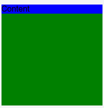
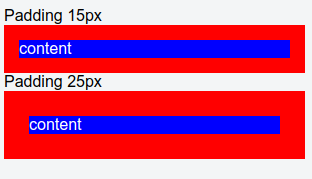
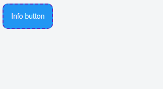
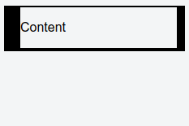
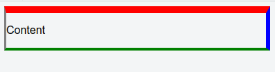
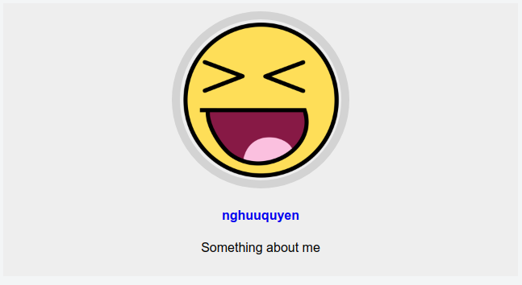
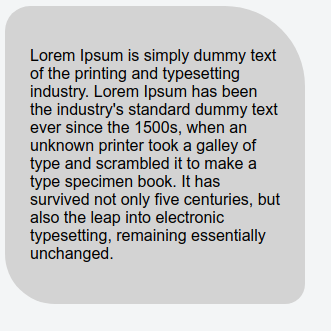
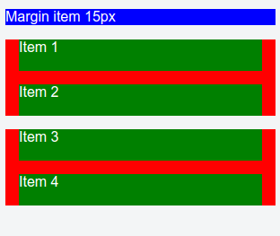
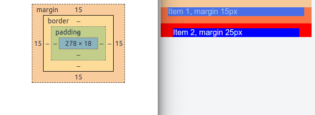
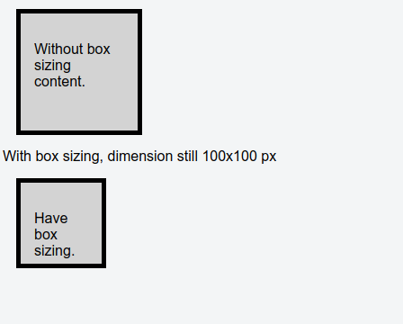

Trong bài học lần này mình sẽ hướng dẫn các bạn về box model,là một thuật ngữ thường được nhắc đến khi thiết kế và bố trí các phần tử HTML.

# 1. Box model là gì ?

Mọi phần tử trong HTML có thể xem như là những khối hộp. Bởi vì nó luôn có phần nội dung bên trong và phần viền xác định ranh giới của nó với các phần tử khác.

**Hình ví dụ**

Box model nói đơn giản là là xác định khoảng cách giữa các khối hộp với nhau hoặc nội dung của khối hộp với đường viền của chính nó.


**Hình ví dụ**


trong kỹ thuật box model, ta có 4 thành phần quan trọng đó là **content**, **border**, **margin**, **padding**,  trong đó:


1) **content** là nội dung bên trong của phần tử.
2) **border** là đường viền của phần tử.
3) **margin** là khoảng cách tính từ viền ngoài của phần tử đến các phần từ khác.
4) **padding** là khoảng cách từ viền trong đến viền ngoài của nội dung chứa bên trong của phần tử.


Chúng ta có hình minh họa như dưới đây.


Tiếp theo chúng ta sẽ lần lượt đi vào từng thành phần một để hiểu rõ cách sử dụng nhé.


# 2. Content trong box model

Content trong box model là vùng mà các phần tử HTML chứa trong box được hiển thị, được xác định bằng hai tham số width và height chính là chiều rộng vào chiều ngang của phần tử chứa trong box đó.


```html
<div class="container">
  <p>Content</p>
</div>
```
Như trên nếu chung ta hình dung có một khối hộp (Box) chứa thẻ div) thì thẻ div và toàn bộ các phần tử con trong thẻ div đó chính là content của box-model

Tiếp theo chúng ta tìm hiểu khái niệm viền của content. Như đã nói trong phần đầu, mọi phần tử HTML đều có thể xem như những khối hộp, chính vì vậy thực chất thẻ p ở trên cũng là một khối hộp, với viền ôm khớp với nội dung chưa bên trong.

Mình sẽ thiết lập màu nên và chiều cao cho các thẻ và chúng ta sẽ thấy rõ hơn.

```css
.container {
  height : 200px;
  width : 200px;
  background-color : green;
}

p {
  background-color : blue;
}
```

Và kết quả là



Các bạn thấy hai màu riêng biệt, còn vì thẻ p hiển thị dạng block nên mặc định chiều ngang sẽ là khớp với phần tử chứa.

# 2. Padding trong box model

Padding là khoảng cách từ viền trong của box đến viền ngoài của content box. Chúng ta thử xem qua ví dụ này để dễ hiểu hơn nhé.



```html
Padding 15px
<div id="div_1" class="container">
    <p>
      content
    </p>
</div>

Padding 25px
<div id="div_2" class="container">
    <p>
      content
    </p>
</div>
```

Và CSS

```css
.container {
  background: red;
}

p {
  margin: 0;
  color: white;
  background: blue;
}

#div_1 {
  padding: 15px;
}

#div_2 {
  padding: 25px;
}
```

Qua ví trên bạn thấy rõ hơn về padding.

Tương tự như các thuộc tính khác, padding cũng có thể viết cho từng cạch của phần tử.

`padding : top right bottom left;`


# 3. Border trong box model

Chính là phần viền của phần tử. Thông thường thì đa số phần tử HTML đều ẩn viền đi không hiển thị ra.

Border gồm 4 thành phần chính là `border-width`, `border-color`, `border-style` và `border-radius` trong đó:

1) **border-style** là kiểu dáng của đường viền

Có các kiểu dáng sau:

**dotted** - Dạng dấu chấm

**dashed** - Dạng đường gạch nối

**solid** - Dạng nét liền

**double** - Dạng hai đường nét liền song song

**groove** - Dạng hiệu ứng rãnh. Hiệu ứng này phụ thuộc vào màu của đường viền

**ridge** - Dạng hiệu ứng dẹt. Hiệu ứng này phụ thuộc vào màu của đường viền

**inset** - Dạng hiệu ứng lõm. Hiệu ứng này phụ thuộc vào màu của đường viền

**outset** - Dạng hiệu ứng lồi. Hiệu ứng này phụ thuộc vào màu của đường viền

**none** - Không có đường viền

**hidden** - Ẩn đường viền

Trong đó dùng nhiều nhất là các hiệu ứng `solid`, `dashed`.

Khi bạn muốn xóa border có thể dùng `none` hoặc `hidden`.

**Ví dụ 2.1** mặc định button có một border bọc ngoài và màu nền. Nếu bạn muốn làm trong suốt màu nền và xóa hoặc định nghĩa lại đường viền thì làm như sau.


```css
.btn-info {
  border-style: dashed;
  background: #2196F3;
  border-color: #612ebd;
  border-radius: 10px;
  padding: 15px;
  color: white;
}
```

Trong đó `border-radius` là định nghĩa bo viền ở 4 góc là 10px;


```html
<button class="btn btn-info">Info button</button>
```

Thì ra được kết quả như sau





2) **border-width** là độ rộng của border, thuộc tính này gồm 4 tham số tương tứng cho 4 cạch.

border-width : top right bottom left;

giá trị đưa vào có thể là in px, pt, cm, em, ...

Ví dụ:

```css
div {
  border-style: solid;
  border-width: 2px 10px 4px 20px;
}
```

Thì chúng ta sẽ có độ rộng đường viên trên, phải , dưới và trái của thẻ div lần lượt là 2px 10px 4px 20px


Thì sẽ có kết quả như sau




3) **border-color** là xác định màu sắc của đường viền

Bạn có thể định nghĩa màu riêng biệt cho từng cạch viên khác nhau, vẫn theo quy tắc chung là trên, phải, dưới , trái.


border-color: top right bottom left;

Ví dụ:

```css
div {
  border-width: 10px 6px 4px 2px;
  border-color: red blue green gray;
  border-style: solid;
}
```

Thì sẽ được kết quả sau:



4) **border-radius** là độ cong ở các góc của đường viền

Bạn có thể định nghĩa độ cong khác nhau cho từng góc khác nhau. Theo cách


border-radius: top right bottom left;

Giá trị nhận vào là px, cm, .... Nếu bạn muốn border thành hình tròn thì để vào là 50%;

**Ví dụ 4.1** Tạo thẻ hình ảnh người dùng hình tròn.

```html
<div class="user-card">
  
  <h4><a href="/nghuuquyen">nghuuquyen</a></h4>
  <p>Something about me</p>
</div>
```

```css
.user-card {
  text-align: center;
  background : #EEE;
  padding: 10px;
}

.user-card a {
  text-decoration: none;
}

.user-card img {
  max-width: 200px;
  border-width : 10px;
  border-color : lightgray;
  border-style: solid;
  border-radius: 50%;
}
```

Thì ta được kết quả như sau




**Ví dụ 4.2** Tạo thẻ nội dung với bo tròn góc.

Áp dụng border-radius có thể tạo ra các bo góc rất mềm mại, tạo điểm nhấn cho thiết kế.


```html
<div class="quote-tag">
  <p>
    Lorem Ipsum is simply dummy text of the printing and typesetting industry. Lorem Ipsum has been the industry's standard dummy text ever since the 1500s, when an unknown printer took a galley of type and scrambled it to make a type specimen book. It has survived not only five centuries, but also the leap into electronic typesetting, remaining essentially unchanged.
  </p>
</div>
```
CSS

```css
.quote-tag {
  background-color : lightgray;
  padding: 25px;
  border-radius: 25px 80px 20px 50px;
  max-width : 250px;
}
```

Và kết quả là




# 4. Margin trong box model

## 4.1 Margin là gì ?

Margin là phần lề bên ngoài box, chính là khoảng cách từ viền ngoài của box đến các phần tử khác.

Để dễ hiểu hơn, các bạn thử xem hình dưới đây.



Để ý hình ta thấy rằng, các item đều được margin 15px nên cái item đều cách nhau đều một khoảng 15px.

Để ý kỹ hơn ở `item 1` và thẻ `p` ở đầu, hai phần tử này cũng cách nhau một đoạn là 15px.

Và dưới đây là mã lệnh của hình trên.

HTML

```html
<p>Margin item 15px</p>
<div class="container">
  <div class="item">
    Item 1
  </div>
  <div class="item">
    Item 2
  </div>
</div>

<div class="container">
  <div class="item">
    Item 3
  </div>
  <div class="item">
    Item 4
  </div>
</div>
```
CSS

```css
.container {
  background: red;
}

p {
  color: white;
  background: blue;
}

.item {
  margin : 15px;
  height : 35px;
  background-color: green;
  color: white;
}
```

## 4.2 Margin collapsing là gì ?

Để ý hình ảnh ở phần 4.1, hai item được margin 15px, nhưng khi được xếp cạnh nhau thì khoảng cách margin vẫn là 15px **mà không phải là 30px theo nguyên lý cộng**.

Nghĩa là khi hai box chạm vào nhau thì khoảng cách margin giữa hai box là giá trị lớn nhất giữa trị số margin chạm nhau. Cách ứng xử như vậy gọi là **margin collapsing**.

Để hiểu rõ hơn nữa bạn hãy xem hình ví dụ bên dưới.




Như hình trên các bạn thấy rằng, item 1 có margin là 15px, item 2 có margin là 25px và cuối cùng vì hiệu ứng `margin collapsing` nên khoảng cách thực giữa hai item 1 và 2 là trị số lớn nhất chính là 25px.


Mã nguồn ví dụ trên.

HTML

```html
<div class="container">
  <div id="div_1">
    <p>
      Item 1, margin 15px
    </p>
  </div>

  <div id="div_2">
    <p>
      Item 2, margin 25px
    </p>
  </div>
</div>
```
CSS

```css
.container {
  background: red;
}

p {
  color: white;
  background: blue;
}

#div_1 {
  margin: 15px;
}

#div_2 {
  margin: 25px;
}
```


# 4. Kích thước thật của của phần tử

Sau khi áp dụng box model lên một phần tử thì trên thực tế chiều rộng và chiều dài thực tế của nó sẽ bị thay đổi theo. Trong thiết kế thì chúng ta phải nắm được giá trị thực sự này.

Đơn giản nó là tổng các giá trị padding, border và margin

Giả sử bạn có một element với CSS như thế này

```css
div {
    width: 320px;
    padding: 10px;
    border: 5px solid gray;
    margin: 5px;
}
```

thì khi đó **chiều rộng thật của phần tử div trên là**:

320px (chiều rộng)  
+ 20px (padding trái, phải)
+ 10px (border trái, phải)
+ 10px (margin trái, phải)

= 370px

Từ đó ta có công thức sau:


**chiều rộng tổng của phần tử** = width + left padding + right padding + left border + right border + left margin + right margin


**chiều cao tổng của phần tử** = height + top padding + bottom padding + top border + bottom border + top margin + bottom margin


Nắm được cánh tính này thì khi thiết kết các bạn mới canh chỉnh chính xác được.


# 5. Kỹ thuật Box sizing

Như phần 4 đề cập đến kích thước thật của phần tử khi áp dụng padding và border. Vấn đề này làm cho lúc thiết kế các bạn phải tính toán nhìu hơn, gây ra khó khăn.

Ngoài ra nếu kích thước phần tử có thể thay đổi phụ thuộc vào border hay padding thì có thể dẫn đến lỗi bể giao diện nếu có ai đó thay đổi các chỉ số này.

Trong CSS, có một kỹ thuật gọi là `box sizing` giúp bạn có thể thay đổi kích thước border hay padding mà vẫn giữ nguyên giá trị width, height ban đầu mà bạn đã định nghĩa cho phần tử. Thực chất là bạn xác định cách tính kích thước hộp.

Để áp dụng box sizing cho môt phần tử bất kỳ, đơn giản là bạn thêm vào cho nó thuộc tính `box-sizing`, thuộc tính này nhận hai giá trị là `border-box` và `content-box`

Trong đó:

1) **border-box** nghĩa là width và height của phần tử bao gồm cả border, padding và nội dung bên trong. **Nhưng không bao gồm margin**.

2) **content-box** nghĩa là width và height của phần tử chi bao gồm nội dung chứa bên trong.


Giá trị mặc định là **content-box** chính vì vậy nên khi thay đổi border hay padding thì kích thước phần tử cũng bị thay đổi theo.


Bây giờ chúng ta thử một ví dụ áp dụng **border-box** nhé.

**Ví dụ 5.1**: Thử nghiệm `box-sizing: border-box;`




Trong ví dụ này, mình tạo ra hai phần tử giống nhau, xác định kích thước là 100x100 px. Sau đó mình mình chỉnh border và padding cho cả hai phần tử.

Kết quả là cả hai đều bị tăng kích cỡ không giống ban đầu là 100x100 px nữa. Tiếp theo đó mình sẽ áp dụng `box-sizing: border-box` cho phần tử thứ 2 và lúc này kết quả là nó vẫn giữ nguyên kích cỡ ban đầu là 100x100.

Mã lệnh ví dụ trên ở dưới đây.


```html
<div class="container">
  <p>
    Without box sizing content.
  </p>
</div>

With box sizing, dimension still 100x100 px
<div class="container box-sizing">
  <p>
    Have box sizing.
  </p>
</div>
```

Và CSS

```css
.container {
  background-color: lightgray;
  width: 100px;
  height: 100px;
  padding: 15px;
  border: 5px solid #000;
  margin: 15px;
}

.box-sizing {
  box-sizing: border-box;
}
```

**Với kỹ thuật box-sizing** bạn đã có thể dễ dàng hơn trong việc thiết kế, **Chỉ cần xác định trước width, height và margin là đủ**.


## Tác giả

**Name:** Nguyễn Hữu Quyền ( Quyen Nguyen Huu )

**Email:** nghuuquyen@gmail.com

**Website:** [Sociss Class - Online Education Center](https://sociss.edu.vn/)

**Profile Page:** [Nguyen Huu Quyen - Profile Page ](https://sociss.edu.vn/users/nghuuquyen)
