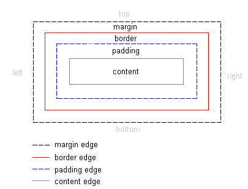

Trong bài học lần này mình sẽ hướng dẫn các bạn về box model,là một thuật ngữ thường được nhắc đến khi thiết kế và bố trí các phần tử HTML.

# 1. Box model là gì ?

Mọi phần tử trong HTML có thể xem như là những khối hộp. Bởi vì nó luôn có phần nội dung bên trong và phần viền xác định ranh giới của nó với các phần tử khác.

**Hình ví dụ**

Box model nói đơn giản là là xác định khoảng cách giữa các khối hộp với nhau hoặc nội dung của khối hộp với đường viền của chính nó.


**Hình ví dụ**


trong kỹ thuật box model, ta có 4 thành phần quan trọng đó là **content**, **border**, **margin**, **padding**,  trong đó:


1) **content** là nội dung bên trong của phần tử.
2) **border** là đường viền của phần tử.
3) **margin** là khoảng cách tính từ viền ngoài của phần tử đến các phần từ khác.
4) **padding** là khoảng cách từ viền trong đến viền ngoài của nội dung chứa bên trong của phần tử.


Chúng ta có hình minh họa như dưới đây.



Tiếp theo chúng ta sẽ lần lượt đi vào từng thành phần một để hiểu rõ cách sử dụng nhé.


# 2. Content trong box model

Content trong box model là nội dung chứa bên trong phần tử đó. ví dụ chúng ta có đoạn mã sau


```html
<div class="container">
  <p>Content</p>
</div>
```

Thì nếu chúng ta đang suy xét áp dụng box model cho thẻ div.container thì thẻ p được xem là content của thẻ div.container

Tiếp theo chúng ta tìm hiểu khái niệm viền của content. Như đã nói trong phần đầu, mọi phần tử HTML đều có thể xem như những khối hộp, chính vì vậy thực chất thẻ p ở trên cũng là một khối hộp, với viền ôm khớp với nội dung chưa bên trong.

Mình sẽ thiết lập màu nên và chiều cao cho các thẻ và chúng ta sẽ thấy rõ hơn.

```css
.container {
  height : 200px;
  width : 200px;
  background-color : green;
}

p {
  background-color : blue;
}
```

Và kết quả là


Các bạn thấy hai màu riêng biệt, còn vì thẻ p hiển thị dạng block nên mặc định chiều ngang sẽ là khớp với phần tử chứa.


# 2. Border trong box model

Chính là phần viền của phần tử. Thông thường thì đa số phần tử HTML đều ẩn viền đi không hiển thị ra.

Border gồm 4 thành phần chính là `border-width`, `border-color`, `border-style` và `border-radius` trong đó:

1) **border-style** là kiểu dáng của đường viền

Có các kiểu dáng sau:

**dotted** - Dạng dấu chấm

**dashed** - Dạng đường gạch nối

**solid** - Dạng nét liền

**double** - Dạng hai đường nét liền song song

**groove** - Dạng hiệu ứng rãnh. Hiệu ứng này phụ thuộc vào màu của đường viền

**ridge** - Dạng hiệu ứng dẹt. Hiệu ứng này phụ thuộc vào màu của đường viền

**inset** - Dạng hiệu ứng lõm. Hiệu ứng này phụ thuộc vào màu của đường viền

**outset** - Dạng hiệu ứng lồi. Hiệu ứng này phụ thuộc vào màu của đường viền

**none** - Không có đường viền

**hidden** - Ẩn đường viền

Trong đó dùng nhiều nhất là các hiệu ứng `solid`, `dashed`.

Khi bạn muốn xóa border có thể dùng `none` hoặc `hidden`.

**Ví dụ 2.1** mặc định button có một border bọc ngoài và màu nền. Nếu bạn muốn làm trong suốt màu nền và xóa hoặc định nghĩa lại đường viền thì làm như sau.


```css
.btn-info {
  border-style: dashed;
  background: #2196F3;
  border-color: #612ebd;
  border-radius: 10px;
  padding: 15px;
  color: white;
}
```

Trong đó `border-radius` là định nghĩa bo viền ở 4 góc là 10px;


```html
<button class="btn btn-info">Info button</button>
```

Thì ra được kết quả như sau


2) **border-width** là độ rộng của border, thuộc tính này gồm 4 tham số tương tứng cho 4 cạch.

border-width : top right bottom left;

giá trị đưa vào có thể là in px, pt, cm, em, ...

Ví dụ:

```css
div {
  border-style: solid;
  border-width: 2px 10px 4px 20px;
}
```

Thì chúng ta sẽ có độ rộng đường viên trên, phải , dưới và trái của thẻ div lần lượt là 2px 10px 4px 20px


Thì sẽ có kết quả như sau


3) **border-color** là xác định màu sắc của đường viền

Bạn có thể định nghĩa màu riêng biệt cho từng cạch viên khác nhau, vẫn theo quy tắc chung là trên, phải, dưới , trái.


border-color: top right bottom left;

Ví dụ:

```css
div {
  border-width: 10px 6px 4px 2px;
  border-color: red blue green gray;
  border-style: solid;
}
```

Thì sẽ được kết quả sau:


4) **border-radius** là độ cong ở các góc của đường viền

Bạn có thể định nghĩa độ cong khác nhau cho từng góc khác nhau. Theo cách


border-radius: top right bottom left;

Giá trị nhận vào là px, cm, .... Nếu bạn muốn border thành hình tròn thì để vào là 50%;

**Ví dụ 4.1** Tạo thẻ hình ảnh người dùng hình tròn.

```html
<div class="user-card">
  
  <h4><a href="/nghuuquyen">nghuuquyen</a></h4>
  <p>Something about me</p>
</div>
```

```css
.user-card {
  text-align: center;
  background : #EEE;
  padding: 10px;
}

.user-card a {
  text-decoration: none;
}

.user-card img {
  max-width: 200px;
  border-width : 10px;
  border-color : lightgray;
  border-style: solid;
  border-radius: 50%;
}
```

Thì ta được kết quả như sau


**Ví dụ 4.2** Tạo thẻ nội dung với bo tròn góc.

Áp dụng border-radius có thể tạo ra các bo góc rất mềm mại, tạo điểm nhấn cho thiết kế.


```html
<div class="quote-tag">
  <p>
    Lorem Ipsum is simply dummy text of the printing and typesetting industry. Lorem Ipsum has been the industry's standard dummy text ever since the 1500s, when an unknown printer took a galley of type and scrambled it to make a type specimen book. It has survived not only five centuries, but also the leap into electronic typesetting, remaining essentially unchanged.
  </p>
</div>
```
CSS

```css
.quote-tag {
  background-color : lightgray;
  padding: 25px;
  border-radius: 25px 80px 20px 50px;
  max-width : 250px;
}
```

Và kết quả là


