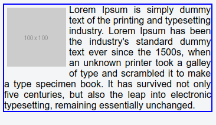
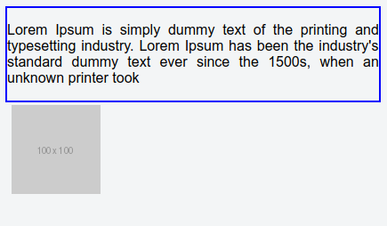

# 1. Kỹ thuật float là gì ?

Trong bài này mình sẽ trình bày về float (Trôi dạt). Một kỹ thuật vô cùng quan trọng trong thiết kế web.

Sau bài học mình muốn các bạn nắm vững và hiểu về hai khái niệm `float` và `clearfix`.


**Float là một kỹ thuật mà chúng ta thiết lập phần tử HTML trôi dạt về một hướng nào đó để lấp đầy các khoảng trống nếu có thể trong một khung chứa.**

**Đặc biệt** Khi một phần tử float, thì **các phần tử kề cạnh nó sẽ trôi dạt theo** để lấp đầy khoảng trống đó nếu có thể.


Khi áp dụng float chúng ta có bốn phần chính cần quan tâm:

1) Khung chứa
2) Phần tử trôi dạt
3) Các phần tử bị trôi dạt kéo theo
4) Kích thước của phần tử trôi dạt

Để áp dụng float lên một phần tử thì chúng ta thiết lập thuộc tính CSS `float` cho nó với hai giá trị là `left` hoặc `right`

```css
div.col-left {
  float: left;
}

div.col-right {
  float: right;
}
```

Với `float: left` là phần tử đó sẽ trôi về trái và `float: right` là sẽ trôi về bên phải cho đến khi chạm vào viền khung chứa.


**Ví dụ 1.1** Thiết lập hình ảnh trôi về góc trái trên trong khung bài viết và để cho nội dung bài viết bao quanh hình ảnh đó.



Như hình trên, mình thiết lập hình ảnh float về trái. Lúc này các đoạn text sẽ chủ động float theo để lấp đầy khoảng trống còn lại.


Và mã lệnh trong ví dụ trên là

```html
<div class="post-container">
   Lorem Ipsum is simply dummy text of the printing and typesetting industry. Lorem Ipsum has been the industry's standard dummy text ever since the 1500s, when an unknown printer took
  a galley of type and scrambled it to make a type specimen book. It has survived not only five centuries, but also the leap into electronic typesetting, remaining essentially unchanged.
</div>
```

CSS

```css
.post-container {
  border: 2px solid blue;
  text-align: justify;
}

.post-container img {
  float: left;
  margin: 5px;
}
```


**Câu hỏi** Điều gì diễn ra nếu hình ảnh không float. Bạn có thể thử nghiệm nó, kết quả sẽ như dưới đây.


Các bạn xem hình sẽ thấy nếu hình ảnh không float thì nó sẽ hiển thị trên một dòng như bình thường, và chữ sẽ chèn vào sau nó vì img là thẻ inline.

Khi có float cho image thì điều đặc biệt diễn ra, các phần tử khác sẽ trôi dạt về để lấp đầy khoảng trống xung quanh phần tử đó.


**Ví dụ 1.3** Đóng khung đoạn văn bản ở ví dụ 1 trong thẻ p và di chuyển thẻ img về dưới cùng.


```html
<div class="post-container">
  <p>
    Lorem Ipsum is simply dummy text of the printing and typesetting industry. Lorem Ipsum has been the industry's standard dummy text ever since the 1500s, when an unknown printer took
  </p>
  
</div>
```

Khi làm như trên thì bạn nhận được kết quả như sau




Lúc này hình ảnh bị đẩy luôn ra ngoài khung, **Tại sao vậy ?**.

Đơn giản là đặc tính của thẻ p là khối (block) nên nó sẽ mở rộng chiều ngang khớp với khung chứa.

**Nghĩa là không có không gian trống nào ở phía trên để thẻ img có thể trôi vào để lấp vào cả**.


**Thế tại sao nó lại bị đẩy ra khỏi khung chứa ?**

Câu hỏi trên là đúng vì sao vậy, thẻ image vẫn ở trong khung mà, sao lại bị ra ngoài.


Nguyên nhân là do khi một phần tử float thì mọi phần tử khác đề float theo, **dẫn đến các lỗi không thể đoán trước được**. Như trên thì ta thấy là hình ảnh bị đẩy văng ra khỏi khung.


Và để xử lý lỗi đó thì ta có kỹ thuật gọi là **clearfix**.


# 2. Kỹ thuật clearfix

Clearfix là kỹ thuật ngăn không cho các phần tử khác float theo. Nôm na nó hiểu như là một thanh chắn vậy.

Đầu tiên chúng ta thử tìm hiểu xem lỗi như thế nào thì cần clearfix.

**Ví dụ 2.1** Tạo một thẻ sản phẩm, với 3 hình ảnh ở trên và một đoạn văn bản ở bên dưới. Yêu cầu áp dụng float cho 3 hình ảnh để thân thiện khi xem trên điện thoại động.


Chúng ta có thể có đoạn mã như dưới đây để giải quyết yêu cầu trên.

```html
<div class="product-card-container">
  <div class="product-images">
    <div class="item">
      
      <div>Image 1</div>
    </div>
    <div class="item">
      
      <div>Image 1</div>
    </div>
    <div class="item">
      
      <div>Image 1</div>
    </div>
  </div>
  <p>
    Lorem Ipsum is simply dummy text of the printing and typesetting industry. Lorem Ipsum has been the industry's standard dummy text ever since the 1500s, when an unknown printer took a galley of type and scrambled it to make a type specimen book.
  </p>
</div>
```

Và CSS

```css
.product-card-container {
  border: 2px solid blue;
}

.product-card-container .product-images .item {
  float: left;
  border: 2px solid green;
  margin: 5px;
}
```

Tuy nhiên khi chạy đoạn code trên thì lại bị kết quả như thế này


Nguyên do là vì đoạn text bên dưới sẽ tự nhảy lên để lấp vào vị trí trống còn dư của 3 hình ảnh ở.

Lúc này để ngăn lỗi trên bạn sẽ áp dụng clearfix để chặn thẻ p lại

Chèn đoạn mã `<div style="clear: both;" />` ở sau thẻ khung chứa các phần tử float để chặn thẻ p lại.

Cụ thể khung chứa ở đây chính là thẻ **div.product-images**

```html
<div class="product-images">
  ... Float items container
</div>

<!-- Clearfix -->
<div style="clear: both;" />
<!-- ./ Clearfix -->

<p>
  Lorem Ipsum .......
</p>
```

Và kết quả lúc này là như thế này


Mọi thứ bây giờ đã đúng ý đồ rồi.


Vậy ở trên mình tạo ra một thẻ div với thuộc tính css là `clear: both` nghĩa là ngăn chặn trôi theo cả hai phía, trái hoặc phải.

Trong trường hợp ở ví dụ trên là bị float left nên nếu bạn thay bằng

```html
<div style="clear: left;" />
```

Kết quả cũng tương tự, vì nó ngăn thẻ p không cho trôi về phía trái.

**Làm sao để không phải chèn trực tiếp các thẻ div để clearfix ?**

Để không phải trực tiếp chèn thẻ div vào phía sau một khung chứa thì chúng ta sẽ áp dụng `Pseudo-elements` lên khung chứa đó.

`Pseudo-elements` tức là tạo ra một phần tử ảo lên một phần tử, cụ thể mình sẽ dùng `::after` tức là tạo ra một phẩn tử ảo ở sau cùng.

Nó tương tự như bạn chèn thêm một thẻ div ở sau vậy. Về `Pseudo-elements` thì bạn có thể xem thêm ở cái bài học sau, phần này mình chỉ mang tính chất giới thiệu.

Bạn chèn thêm đoạn code sau vào mã CSS, mục đích là để tạo ra một phần tử chứa dấu chấm (.) nhưng không hiển thị ra, trên đó thì thiết lập `clear:both`. Tại sao lại là dấu `.` thì đơn giản để nó có nội dung thì mới được trình duyệt cho phép, không thì nó sẽ không bao giờ xuất hiện.

```css
.product-card-container .product-images::after {
  content: ".";
  visibility: hidden;
  display: block;
  height: 0;
  clear: both;
}
```

Và lúc này bạn xóa `<div style="clear: both;" />` đi và mọi thứ vẫn ổn. Lúc này nếu bạn mở trình duyệt lên và inspect thì sẽ thấy nó chèn phần tử `::after` này vào sau khung chứa `div.product-images`.


Tới đây thì bạn đã hiểu về hai thuật ngữ **float** và **clearfix** và cách áp dụng nó.

# 3. Kích thước phần tử khi áp dụng float

Thường thì một phần tử được float hay được quy định kích thước trước (width hoặc height).

Vì khi một phần tử được float thì nó sẽ tự động chuyển về dạng khối (block) khi đó, nếu bạn không quy định kích thước (width, height) thì có thể nó sẽ bị gặp phải trường hợp kích thước phần tử sẽ bị thu nhỏ, dẫn đến biến dạng giao diện.

**Vì sao lại như vậy ?**

Vì kỹ thuật float có một số quy định dưới đây:


**1) Nếu phần tử đó là inline (nội tuyến) thì sẽ bị chuyển thành dạng khối (block).**

Bạn có thể thử nghiệm ví dụ nhỏ sau để chứng mình điều trên. Áp dụng float lên thẻ span, sau đó áp dụng margin lên thẻ span đó.

```html
<p>
  Lorem Ipsum is simply dummy text of the printing and typesetting industry.
</p>
<span> I'm span </span>
```

Và CSS

```css
span {
  float: right;
  margin: 35px;
  height: 50px;
  border: 2px solid #000;
}
```


Và kết quả là các bạn thấy `margin` và `height` hoạt động trên phần tử span, đây là điều không thể có ở phần tử dạng inline như mình để cập ở bài trước. Nhưng nó lại chạy được nghĩa là span ở trên đã bị chuyển về dạng khối (block).


**1) Nếu phần tử đó là block (dạng khối) và không được định nghĩa kích thước thì sẽ bị cắt gọn về khớp với nội dung bên trong.**


Bạn có thể thử nghiệm bằng đoạn mã sau

HTML
```html
<div class="none-float"> Content </div>
<div class="float-item"> Content </div>
```

CSS

```css
.none-float {
  background: red;
  height: 50px;
}

.float-item {
  background: blue;
  height: 50px;
  float: left;
}
```

Và kết quả là


Các bạn sẽ thấy thẻ div màu xanh bị rút gọn chiều ngang.


Hiểu được hai quy định này của float sẽ giúp các bạn làm việc tốt hơn. Và cũng hiểu rõ tại sao các phần tử float nên được quy định kích thước trước để tránh bị lỗi không mong muốn.


Tới đây là bạn đã nắm vững `float` và `clearfix` đồng thời hiểu về vấn đề định nghĩa kích thước trong việc kỹ thuật float.

Ở bài học tiếp theo chúng ta sẽ ứng dụng float để xây dựng giao diện dạng cột (column) hoặc dạng lưới (grid).


# Tác giả

**Name:** Nguyen Huu Quyen ( Nguyễn Hữu Quyền )

**Email:** nghuuquyen@gmail.com

**Website:** [Sociss Class - Online Education Center](https://sociss.edu.vn/)

**Profile Page:** [Nguyen Huu Quyen - Profile Page ](https://sociss.edu.vn/users/nghuuquyen)
