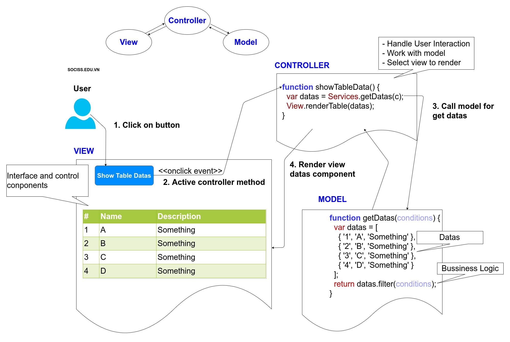
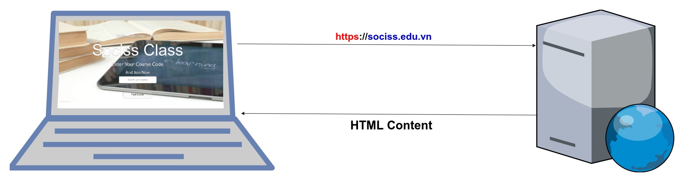
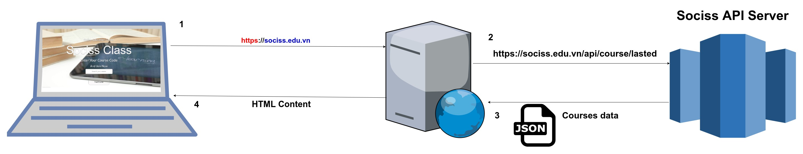

# Một số kiến thức cần trong buổi offline 

### 1. Mô hình MVC 

Mô hình này cũng không còn là mới nữa, tuy nhiên vẫn còn được ứng dụng rất nhiều. MVC cơ bản là bạn sẽ phân tách View (Giao diện) và các mã lệnh nghiệp vụ (Model) ra khỏi nhau thông qua một trung gia điều khiển là Controller.

Các bạn để ý như trên hình, phần model chứa dữ liệu và các logic nghiệp vụ. Trong khi đó Controller chịu trách nhiệm xử lý tương tác người dùng, lấy dữ liệu từ model và render ra view phù hợp. Còn ở phần View thì trong ví dụ này chính là phần giao diện HTML và CSS.

**Tìm hiểu thêm**

Hiện nay các mô hình mới thường được sử dụng là MVVM, MVP các bạn có thể tra cứu thử.

### 2. Hiểu về Webservice và RESTFul APIs 

Khi nói đến lập trình frontend thì không thể không nói đến webservice. 

#### 2.1 - Phân biệt Web và Web Service.

**Đầu tiên trước khi nói đến khái niệm webserivce chúng ta cần nói về khái niệm web hay website bình thường.**

Ví dụ như Sociss, khi các bạn request vào URL **sociss.edu.vn** thì máy chủ sẽ trả về một trang HTML hoàn chỉnh, trình duyệt chỉ đơn giản là nhận nội dung này và hiển thị lên.

 Khác với điều trên, Webserivce không như vậy. Một webserivce thường chỉ trả về phần thông tin thô dưới dạng JSON, XML. Và bạn phải có nhiệm vụ viết mã lệnh ở đâu đó để xử lý thông tin này trước khi trả về cho người dùng.
 
 
 
 Ví dụ một kịch bản khác của Sociss, là khi bạn reuquest vào trang chủ Sociss là máy chủ web của sociss sẽ gọi vào API server của sociss để lấy danh sách các khóa học mới nhất ở dạng thô (JSON) và tại máy chủ web, dữ liệu thô trên sẽ được xử lý và trả về trang HTML cho người dùng.

#### 2.2 - Hiểu về nghĩa từ API 

API là application programing interface, dịch theo tiếng Việt là giao diện lập trình ứng dụng, dịch theo cách này **dễ bị hiểu nhầm** là một giao diện cho các bạn kéo thả lập trình ứng dụng, **tuy nhiên KHÔNG PHẢI NHƯ VẬY**.

API đúng nghĩa được hiểu là công cụ để các ứng dụng hoặc các module trong một ứng dụng giao tiếp với nhau.

#### 2.3 - REST APIs và RESTFul Webservice  

 Các bạn tưởng tượng, các bạn có hai chương trình phần mềm chạy độc lập với nhau, câu hỏi là làm sao để hai chương trình này trao đổi dữ liệu với nhau ?
 
 Để trả lời câu hỏi đó, thì chúng ta sẽ có một số các phương thức giao tiếp tiến trình (IPC - Inter Processes Communication).
 
Trong các cơ chế IPC có một cơ chế thuộc kiểu tương tác 1-1 (Điểm-điểm) đồng bộ request/response trên nền giao thức HTTP, và với kiểu tương tác này người ta thường sử dụng một kiến trúc gọi là REST.

**Vậy từ đó RESTFul Webservice là Webservice được viết bằng kiến trúc REST.**

Nếu cần hiểu lại sâu hơn một chút về HTTP các bạn có thể đọc bài này của mình. [Giao thức HTTP là gì ? ](https://sociss.edu.vn/courses/nodejs/lesson/giao-thuc-http-la-gi) 

REST là một bộ quy tắc để tạo ra một ứng dụng Web Service, mà nó tuân thủ 4 nguyên tắc thiết kế cơ bản sau:

+ Sử dụng các phương thức HTTP một cách rõ ràng
+ Phi trạng thái
+ URL có cấu trúc thư mục như các URls
+ Truyền tải JavaScript Object Notation (JSON), XML hoặc cả hai.

Dừng tại đây mình sẽ không đi sâu hơn, chỉ cần các bạn hiểu đó là một kiến trúc là đủ rồi.

#### 2.4 - REST APIs dùng làm gì trong lập trình Frontend ?

Ngắn gọn là frontend dev sẽ sử dụng các webservice để lấy các dữ liệu thô, sau đó từ dữ liệu thô này sẽ viết các mã lệnh sử lý bằng Javascipt và render ra các thành phần giao diện ứng dụng.

**Ví dụ các bạn cần viết một giao diện liệt kê ra tất cả các post trên facebook wall của mình thì sẽ làm ra sao ?**

Các bạn cần phải hỏi là facebook có cung cấp các API đó không, có phải dạng REST không và nó ở đâu. Sau khi tra google thì nó ở đây.

[Facebook Post API ](https://developers.facebook.com/docs/graph-api/reference/v2.11/post) 

Các bạn sẽ vào link trên, đọc hướng dẫn sử dụng để xem cấu trúc URL ra sao, method là gì, các đối số kèm theo ra sao. Và cuối cùng là dùng AJAX của Javascript để gọi lên lấy dữ liệu. Khi đã có dữ liệu rồi thì việc còn lại chỉ là xử lý và render lên giao diện thôi.

