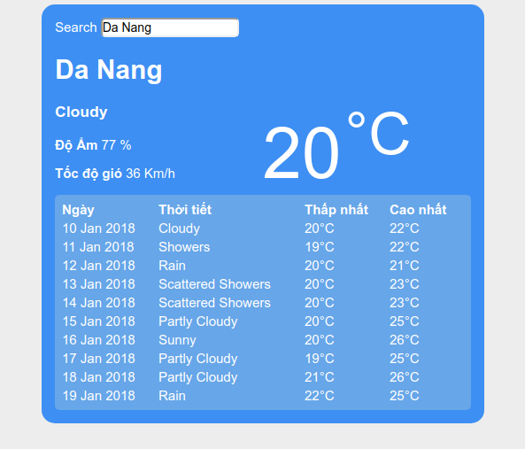
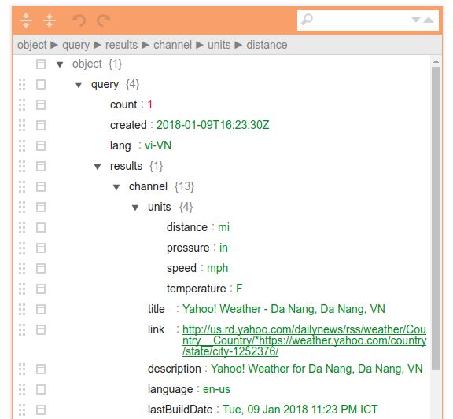

# Lab 3 - Sociss Weather Card

Trong bài lap thứ 3 này với mục đích luyện tập các nội dung sau

1) Thực hành gửi và nhận dữ liệu qua AJAX.
2) Tạo giao diện dạng bảng bằng HTML và Javascript.

Kết quả của bài lap này chúng ta sẽ có sản phẩm như sau.



Các bạn có thể nhập tên thành phố vào ô tìm kiếm, nhấn enter và ứng dụng sẽ gọi một truy vấn đến Yahoo weather để lấy dữ liệu thời tiết của thành phố đó về.

## 1. Tìm hiểu nhanh về Yahoo Weather API

Yahoo cung cấp một endpoint API để các bạn có thể truy cập lấy thông tin thời tiết như sau

Chúng ta sẽ gọi một truy vấn HTTP trên method GET với URI như sau

**Các ban có thể copy đường dẫn bên dưới và mở bằng trình duyệt của mình**.

```
https://query.yahooapis.com/v1/public/yql?q=select * from weather.forecast where woeid in (select woeid from geo.places(1) where text='Da Nang')&format=json
```

Trong đó `https://query.yahooapis.com/v1/public/yql` chính là URI Endpoint để truy vấn thông tin thời tiết, Endpoint này chấp nhận một query param là `q` chứa một câu lệnh YQL (Yahoo Query Language - là một ngôn ngữ truy vấn được định nghĩa ra bởi Yahoo Inc).

Câu lệnh này có nội dung như sau

`select * from weather.forecast where woeid in (select woeid from geo.places(1) where text='Da Nang')`

Ý nghĩa của câu lệnh trên là để lấy thông tin thời tiết của nơi có tên định danh chứa hoặc bằng giá trị `text` trong câu truy vấn.

Ở đây mình đặt `text` bằng giá trị `Da Nang` nghĩa là mình muốn truy vấn thông tin thời tiết của thành phố Đà Nẵng, Việt Nam.

Và kết quả trả về mình muốn ở Dạng JSON nên mình sẽ thêm vào một đối số là `format=json` như vậy thì kết quả trả về sẽ có định dạng JSON.

**Mẫu kết quả trả về từ truy vấn trên**


```json
{  
  "query":{  
    "count":1,
    "created":"2017-12-21T08:19:44Z",
    "lang":"vi-VN",
    "results":{  
      "channel":{  
        "units":{  },
        "title":"Yahoo! Weather - Da Nang, Da Nang, VN",
        "description":"Yahoo! Weather for Da Nang, Da Nang, VN",
        "language":"en-us",
        "lastBuildDate":"Thu, 21 Dec 2017 03:19 PM ICT",
        "ttl":"60",
        "location":{  },
        "wind":{  },
        "atmosphere":{  },
        "astronomy":{  },
        "image":{  },
        "item":{  }
      }
    }
  }
}
```

Trong đó các bạn thấy có đầy đủ thông tin về thành phố Đà Nẵng, các thuộc tính mình quan tâm đó là `wind` chứa thông tin về tốc độ gió, `atmosphere` chứa thông tin bầu khí quyển (tầm nhìn, độ ẩm) và `item` chứa các thông tin về dự đoán thời tiết, và quan trọng hơn hết là `units` chứa thông tin về các đơn vị đo được sử dụng.

Lần lượt chúng ta sẽ tìm hiểu dữ liệu chưa trong các khối thông tin quan trọng trên.

Đầu tiên là phần `units` chứa thông tin về đơn vị đo

```json
"units":{  
  "distance":"mi",
  "pressure":"in",
  "speed":"mph",
  "temperature":"F"
}
```

Các bạn sẽ thấy rằng đơn vị đó tốc độ gió là mph, nhiệt độ là độ F và đơn vị đo khoảng cách là Mile (Dặm Anh) 1 dặm Anh xấp xỉ 1.6093 Km

Ở Việt Nam thì chúng ta thường dùng thang đo là Km, Độ C và Km/h chính vì vậy khi hiển thị thì phải chuyển đổi về thang đo phù hợp để dễ đọc cho người Việt mình.

Tiếp theo là đến phần `wind` chứa thông tin về gió

```json
"wind":{  
  "chill":"68",
  "direction":"338",
  "speed":"22"
}
```

Với `chill` là độ lạnh, `speed` là tốc độ còn `direction` là hướng gió.

Tiếp theo là phần `atmosphere` chứa thông tin về khí quyển

```json
"atmosphere":{  
  "humidity":"70",
  "pressure":"1016.0",
  "rising":"0",
  "visibility":"16.1"
}
```

Với `humidity` là độ ẩm tính theo % , `pressure` là áp lực không khí , `visibility` là tầm nhìn tính theo dặm Anh (Mile).


Tiếp đến đi sâu vào thuộc tính `item` và đi đến thuộc tính `condition` sẽ chứa thông tin về địa danh mà bạn đã chọn.

```json
"condition":{  
  "code":"26",
  "date":"Thu, 21 Dec 2017 02:00 PM ICT",
  "temp":"68",
  "text":"Cloudy"
}
```

Trong đó các bạn quan tâm đến `text` chính là mô tả ngắn về thời tiết hiện tại, giá trị Cloudy chính là chỉ trời nhiều mây.

## 2. Ý tưởng thực hiện

Chúng ta sẽ thực hiện một lời gọi AJAX bằng đối tượng XMLHttpRequest của Javascript lên Yahoo Weather API với đối số `cityName` nhập từ ô search.

Ví dụ như sau.

```js
function loadWeather(cityName) {
  var query = "https://query.yahooapis.com/v1/public/yql?" +
  "q=select * from weather.forecast where woeid in " +
  "(select woeid from geo.places(1) where text='" + cityName + "')&format=json";

  var xhttp = new XMLHttpRequest();
  xhttp.onreadystatechange = function() {
    if (this.readyState == 4 && this.status == 200) {
      var data = JSON.parse(xhttp.responseText);

      if(!data.query.results) {
        callback(new Error('Không tìm thấy thành phố'), null);
      }

      console.log(data);
    }
  }

  xhttp.open("GET", query, true);
  xhttp.send();
}
```

Các bạn có thể chạy thử hàm trên với đối số `Da Nang` như sau

```js
loadWeather('Da Nang');
```

Sau đó mở Browser Console ra để xem kết quả (Ctrl + Shift + I )

### 3. Bắt tay vào làm

Chúng ta sẽ làm ứng dụng theo mô hình MVC.

#### 4.1 Phần View

Phần mã lệnh HTML sẽ như sau.


```html
<div class="weather-card">
  <form name="search">
    Search <input id="search-input" type="text" name="city_name" placeholder="Nhập tên thành phố "/>
  </form>

  <div class="header">
    <div class="city-column">
      <h1 id="city_name">City Name</h1>
      <h3 id="city_weather">City weather</h3>
      <p><b>Độ Ẩm</b> <span id="humidity">Humidity</span> %</p>
      <p><b>Tốc độ gió</b> <span id="wind">Temperature</span> Km/h</p>
    </div>
    <div class="temperature-column">
      <span id="temperature">45</span>
      <span><sup>°C</sup><span>
      </div>
    </div>
    <div class="body">
      <table id="predict-table">
        <tr>
          <th>Ngày</th>
          <th>Thời tiết</th>
          <th>Thấp nhất</th>
          <th>Cao nhất</th>
        </tr>
        <!-- data added to here -->
      </table>
    </div>
  </div>
</div>
```

Các bạn để ý mình để các thuộc tính ID cho các vị trí cần đổ thông tin vào, để sau này chúng ta có thể dùng Javascript thông qua DOM cập nhật nội dung các vị trí này.


#### 3.2 Phần Controller Và Model  

Đầu tiên là mã lệnh lấy thông tin thời tiết theo tên thành phố

```js
function loadWeather(cityName, callback) {
  var query = "https://query.yahooapis.com/v1/public/yql?" +
  "q=select * from weather.forecast where woeid in " +
  "(select woeid from geo.places(1) where text='" + cityName + "')&format=json";

  var xhttp = new XMLHttpRequest();
  xhttp.onreadystatechange = function() {
    if (this.status == 200) {
      var data = JSON.parse(xhttp.responseText);

      if(!data.query.results) {
        callback(new Error('Không tìm thấy thành phố'), null);
      }

      callback(null, filterYahooWeatherData(data));
    }
  }

  xhttp.open("GET", query, true);
  xhttp.send();
}
```

Các bạn để ý là dữ liệu trả về từ Yahoo rất là nhiều, nhưng mà chúng chỉ cần một ít dữ liệu trong số đó, nên mình sẽ viết thêm một hàm để lọc lấy những dữ liệu mà chúng ta cần để dễ xử lý.

Các bạn để ý là vì đơn vì người Việt mình dùng là Km/h và Độ C nên phải có bước quy đổi từ Mph và Độ F về để dễ đọc.


```js
function filterYahooWeatherData(data) {
  var results = {
    cityName : data.query.results.channel.location.city,
    wind : data.query.results.channel.wind.speed,
    humidity : data.query.results.channel.atmosphere.humidity,
    temp : data.query.results.channel.item.condition.temp,
    weather : data.query.results.channel.item.condition.text,
    forecast : data.query.results.channel.item.forecast
  };

  // Cover C to F, We have C = 5/9 (F – 32)
  results.temp = Math.ceil((5 / 9) * (results.temp - 32));
  // Cover Mph to Km/h
  results.wind = Math.ceil(results.wind * 1.6);

  return results;
}
```

**Chú ý**: Vị trí của các thông tin cần thiết trong biến JSON có thể lấy được khi các bạn phân tích chuỗi JSON trả về từ Yahoo bằng công cụ như là

http://jsoneditoronline.org/



Hoặc các bạn cũng có thể log chuỗi JSON ra console của trình duyệt rồi dùng tính năng copy properties path của trình duyệt.


**Một để ý khác đó là lỗi khi các bạn nhập một tên thành phố không tồn tại**, khi mà thuộc tính query.results là null thì có nghĩa là không tìm thấy thành phố đó nên mình sẽ trả về một lỗi.

#### 3.3 Gán dữ liệu nhận được lên View  

Sau khi nhận được dữ liệu thì đến bước tiếp theo là gán dữ liệu đó lên View.


Đầu tiên là chúng ta sẽ tạm gán mặc định một thành phố mặc định lúc load ứng dụng lên, ví dụ mình chọn là thành phố Đà Nẵng


```javascript
loadWeather('Đà Nẵng, Việt Nam', function(err, weather) {
  if(err) {
    alert(err.message);
  } else {
    renderCityWeatherOnCardHeader(weather);
    renderPredictWeatherTable(weather);
  }
});

```

Giao diện của chúng ta gồm 2 phần, phần header bên trên chứa thông tin về thời tiết của thành phố được chọn hiện tại.

Phần còn lại bên dưới là một bảng dữ liệu chứa thông tin dự báo thời tiết của 10 ngày tiếp theo.

Trong đó hàm `renderCityWeatherOnCardHeader();` dùng để render dữ liệu cho phần header. Mã lệnh như sau

```js
function renderCityWeatherOnCardHeader(weather) {
  // Render header card.
  document.getElementById('city_name').innerHTML = weather.cityName;
  document.getElementById('humidity').innerHTML = weather.humidity;
  document.getElementById('temperature').innerHTML = weather.temp;
  document.getElementById('wind').innerHTML = weather.wind;
  document.getElementById('city_weather').innerHTML = weather.weather;
}
```

Rất đơn giản đúng không nào, mình sẽ lấy các phần tử theo ID và chỉnh lại Text bên trong ứng với dữ liệu mình nhận được.


Tiếp theo là phần Table, ý tưởng là chúng ta sẽ dùng Javascript thông qua DOM để tạo ra các dòng (row) cho Table với ID là `predict-table` mà ta đã tạo ra ở View trước đây.


```js
function renderPredictWeatherTable(weather) {
  // Render weather predict table.
  var table = document.getElementById('predict-table');
  cleanTableContent();
  renderTableHeader();

  for(let i in weather.forecast) {
    // Create new row at last index.
    var row = table.insertRow();
    var dayCell = row.insertCell(0);
    var weatherCell = row.insertCell(1);
    var lowCell = row.insertCell(2);
    var hightCell = row.insertCell(3);

    dayCell.innerHTML = weather.forecast[i].date;
    weatherCell.innerHTML = weather.forecast[i].text;
    lowCell.innerHTML = coverFtoC(weather.forecast[i].low) + "°C";
    hightCell.innerHTML = coverFtoC(weather.forecast[i].high) + "°C";
  }
}
```

Trong DOM, Node dạng table có hỗ trợ hàm `table.insertRow()` hàm này sẽ trả tạo ra một dòng mới cho bảng và chèn vào sau cùng.  Sau đó trên dòng mới này chúng ta sẽ chèn lần lượt các ô (cell) và thiết lập dữ liệu cho chúng.

**Chú ý** Khi thiết lập innerHTML không nhất thiết phải là dạng chuỗi thông thường mà còn có thể chèn vào đó mã lệnh HTML.

Ví dụ hàm mình dùng để render lên dòng tiêu đề của bảng dữ liệu.

```js
function renderTableHeader() {
  var table = document.getElementById('predict-table');
  var row = table.insertRow();
  var dayCell = row.insertCell(0);
  var weatherCell = row.insertCell(1);
  var lowCell = row.insertCell(2);
  var hightCell = row.insertCell(3);

  dayCell.innerHTML = '<b>Ngày</b>';
  weatherCell.innerHTML = '<b>Thời tiết</b>';
  lowCell.innerHTML = '<b>Thấp nhất</b>';
  hightCell.innerHTML = '<b>Cao nhất</b>';
}
```


### 4. Mã lệnh hoàn chỉnh

Để chạy được ứng dụng các bạn sẽ tạo ra ba tệp tin index.html, style.css và app.js sau đó lần lượt copy và bỏ vào đó các đoạn lệnh sau


Sau đó mở index.html bằng trình duyệt của mình, chú ý cần có kết nối internet để lấy được dữ liệu thời tiết nhé.


Tệp index.html

```html
<!DOCTYPE html>
<html lang="en">
<head>
  <meta charset="utf-8">
  <meta http-equiv="X-UA-Compatible" content="IE=edge">
  <meta name="viewport" content="width=device-width, initial-scale=1">
  <title>Sociss Weather Card Demo</title>
  <link rel="stylesheet" href="./style.css">
</head>
<body>

  <div class="weather-card">
    <form name="search" onsubmit="searchWeather(event)">
      Search <input id="search-input" type="text" name="city_name" placeholder="Nhập tên thành phố "/>
    </form>

    <div class="header">
      <div class="city-column">
        <h1 id="city_name">City Name</h1>
        <h3 id="city_weather">City weather</h3>
        <p><b>Độ Ẩm</b> <span id="humidity">Humidity</span> %</p>
        <p><b>Tốc độ gió</b> <span id="wind">Temperature</span> Km/h</p>
      </div>
      <div class="temperature-column">
        <span id="temperature">45</span>
        <span><sup>°C</sup><span>
        </div>
      </div>
      <div class="body">
        <table id="predict-table">
          <tr>
            <th>Ngày</th>
            <th>Thời tiết</th>
            <th>Thấp nhất</th>
            <th>Cao nhất</th>
          </tr>
          <tr>
            <td>Monday</td>
            <td>Suny</td>
            <td>22</td>
            <td>25</td>
          </tr>
        </table>
      </div>
    </div>

    <script src="./app.js"></script>
  </body>
  </html>

  ```

  Tệp style.css

  ```css
  * {
    box-sizing: border-box;
  }

  html {
    background-color: #EEE;
  }

  #search-input {
    border-radius: 5px;
  }

  .weather-card {
    width: 80%;
    max-width: 500px;
    margin: 0 auto;
    background-color: #1e98fbf2;
    padding: 15px;
    color: #FFF;
    border-radius: 15px;
  }

  .header .city-column,
  .temperature-column {
    width: 49%;
    display: inline-block;
  }

  .temperature-column span {
    font-size: 80px;
  }

  #predict-table {
    width: 100%;
    text-align: left;
    padding: 5px;
    border-radius: 5px;
    background-color: #7ab6eab5;
  }
  ```


  Tệp app.js


  ```javascript
  loadWeather('Đà Nẵng, Việt Nam', function(err, weather) {
    if(err) {
      alert(err.message);
    } else {
      renderCityWeatherOnCardHeader(weather);
      renderPredictWeatherTable(weather);
    }
  });


  function searchWeather(e) {
    if (e.preventDefault) e.preventDefault();
    var cityName = document.forms["search"]["city_name"].value;

    loadWeather(cityName, function(err, weather) {
      if(err) {
        alert(err.message);
      } else {
        renderPredictWeatherTable(weather);
      }
    });
  }

  function loadWeather(cityName, callback) {
    var query = "https://query.yahooapis.com/v1/public/yql?" +
    "q=select * from weather.forecast where woeid in " +
    "(select woeid from geo.places(1) where text='" + cityName + "')&format=json";

    var xhttp = new XMLHttpRequest();
    xhttp.onreadystatechange = function() {
      if (this.readyState == 4 && this.status == 200) {
        var data = JSON.parse(xhttp.responseText);

        if(!data.query.results) {
          callback(new Error('Không tìm thấy thành phố'), null);
        }

        callback(null, filterYahooWeatherData(data));
      }
    }

    xhttp.open("GET", query, true);
    xhttp.send();
  }

  function filterYahooWeatherData(data) {
    var results = {
      cityName : data.query.results.channel.location.city,
      wind : data.query.results.channel.wind.speed,
      humidity : data.query.results.channel.atmosphere.humidity,
      temp : data.query.results.channel.item.condition.temp,
      weather : data.query.results.channel.item.condition.text,
      forecast : data.query.results.channel.item.forecast
    };

    // Cover C to F, We have C = 5/9 (F – 32)
    results.temp = Math.ceil((5 / 9) * (results.temp - 32));
    // Cover Mph to Km/h
    results.wind = Math.ceil(results.wind * 1.6);

    return results;
  }


  function cleanTableContent() {
    try {
      while(true) {
        document.getElementById('predict-table').deleteRow(0);
      }
    } catch(err) {}
  }


  function renderCityWeatherOnCardHeader(weather) {
    // Render header card.
    document.getElementById('city_name').innerHTML = weather.cityName;
    document.getElementById('humidity').innerHTML = weather.humidity;
    document.getElementById('temperature').innerHTML = weather.temp;
    document.getElementById('wind').innerHTML = weather.wind;
    document.getElementById('city_weather').innerHTML = weather.weather;
  }

  function renderPredictWeatherTable(weather) {
    // Render weather predict table.
    var table = document.getElementById('predict-table');
    cleanTableContent();
    renderTableHeader();

    for(let i in weather.forecast) {
      // Create new row at last index.
      var row = table.insertRow();
      var dayCell = row.insertCell(0);
      var weatherCell = row.insertCell(1);
      var lowCell = row.insertCell(2);
      var hightCell = row.insertCell(3);

      dayCell.innerHTML = weather.forecast[i].date;
      weatherCell.innerHTML = weather.forecast[i].text;
      lowCell.innerHTML = coverFtoC(weather.forecast[i].low) + "°C";
      hightCell.innerHTML = coverFtoC(weather.forecast[i].high) + "°C";
    }
  }


  function renderTableHeader() {
    var table = document.getElementById('predict-table');
    var row = table.insertRow();
    var dayCell = row.insertCell(0);
    var weatherCell = row.insertCell(1);
    var lowCell = row.insertCell(2);
    var hightCell = row.insertCell(3);

    dayCell.innerHTML = '<b>Ngày</b>';
    weatherCell.innerHTML = '<b>Thời tiết</b>';
    lowCell.innerHTML = '<b>Thấp nhất</b>';
    hightCell.innerHTML = '<b>Cao nhất</b>';
  }


  function coverFtoC(value) {
    return Math.ceil((5 / 9) * (value - 32));
  }

  ```
