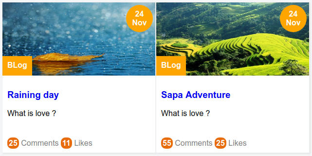

# Lab 5 -




Các bạn xem code chạy thật ở link dưới nhé.

Live Demo: [Demo thẻ bài viết](https://jsfiddle.net/nghuuquyen/q28bsua8/)


Nhìn sơ qua, chúng ta sẽ thấy ngay bố cục trình bày của thẻ trên khá phức tạp, nếu áp dụng float hoặc box model cho các thành phần nhỏ ở thẻ trên thì sẽ gặp nhiều khó khăn, tuy nhiên nếu áp dụng Relative và Absolute thì sẽ rất đơn giản. Nào chúng ta cùng làm.

Đầu tiên tạo nên cấu trúc mã HTML cho thẻ ở trên dựa vào hình thì sẽ được như thế này.

```html
<!-- card -->
<div class="qt-card">
  <div class="card-header">
    <span class="time">24 Nov</span>
    
    <span class="categories">BLog</span>
  </div>
  <div class="card-body">
    <h3><a href="#">Raining day</a></h3>
    <p>
      What is love ?
    </p>
  </div>

  <div class="card-footer">
    <div class="card-statis">
      <a href="#">
        <span>25</span> Comments
      </a>
      <a href="#">
        <span>11</span> Likes
      </a>
    </div>
  </div>
</div>
<!-- ./ card -->
```

Cách chia cấu trúc HTML cho thẻ thì **tùy các bạn**, tuy nhiên mình thì thường chia thành 3 phần , header, body và footer. Sau đó trong mỗi phần mình xác định các thành phần con trong đó rồi đặt tên cho chúng. Và cuối cùng mình có được như trên.

**Ghi chú**: Các bạn nên đặt tên các class sao cho thật dễ hiểu và dễ nhớ nhé.

Tiếp theo là đến phần CSS.

Thì theo hướng tiếp cận SMACSS (Scalable and Modular Architecture for CSS) các nguyên tắc này mình sẽ trình bày kỹ hơn về sau tuy nhiên cách thực hành sẽ như thế này.

Đầu tiên định nghĩa trước CSS cho phần layout (bố cục) và phần cơ sở (base). Trong đó `layout` đại diện cho cách các phần tử được trình bày còn Base là những định nghĩa chung cho toàn bộ các phần tử.

```css
/* Layout */

.row {
  background-color: #EEE;
}

.col {
  float: left;
  width: 50%;
}

/* Base */
a {
  text-decoration: none;
}
```

Như trên mình dự định trình bày thẻ trên một bố cụ dạng cột, và mình muốn tất cả thẻ `a` đều không gạch chân dưới.

Tiếp theo là CSS cho thành phần Card. Theo hướng tiếp cận OOCSS (Object Oriented CSS) về hướng tiếp cận này mình cũng sẽ nói cụ thể trong các bài học sau. Tuy nhiên trong thực hành nó sẽ như thế này.

Định nghĩa CSS cho các class từ cao nhất cho đến thấp nhất theo đúng thứ tự.

Cụ thể là .qt-card --> .card-header --> .card-body --> .card-body

Trong .card-header thì theo thứ tư như sau

.card-header --> .time --> img --> .categories

Nếu các bạn tuân thủ nguyên tắc viết như thế này, thì mã lệnh của các bạn sẽ vô cùng đẹp, thứ hai việc bảo trình sau này sẽ rất tiện và mạch logic suy nghĩ trong đầu cũng rất tự nhiên.


Và CSS của thành phần Card sẽ như sau. Phân tích từng phần sẽ ở bên dưới nhé.


```css
/* Component: Card */

.qt-card {
  background-color: white;
  border: 1px solid #EEE;
  box-shadow: 2px 2px 2px #E7E7E7;
}

.qt-card {
  max-width: 350px;
  min-width: 200px;
}

.qt-card .card-header {
  position: relative;
  height: 150px;
  overflow: hidden;
}

.qt-card .card-header img {
  /* equals to min-width of card */
  min-width: 200px;
  display: block;
  width: 100%;
  height: 100%;
}

.qt-card .card-header .time {
  position: absolute;
  right: 5px;
  top: 5px;
  background-color: orange;
  padding: 10px;
  border-radius: 50%;
  width: 35px;
  word-break: break-word;
  text-align: center;
  color: white;
  font-weight: 600;
  overflow: hidden;
}

.qt-card .card-header .categories {
  background-color: orange;
  position: absolute;
  height: 20px;
  bottom: 0;
  left: 0;
  padding: 10px;
  color: white;
  font-weight: 600;
}

.qt-card .card-body {
  padding: 10px;
  height: 100px;
}

.qt-card .card-body h3 {
  overflow: hidden;
  text-overflow: ellipsis;
  white-space: nowrap;
}

.qt-card .card-body p {
  overflow: hidden;
  text-overflow: ellipsis;
  -webkit-line-clamp: 2;
  display: -webkit-box;
  -webkit-box-orient: vertical;
}

.qt-card .card-footer {
  padding: 10px;
}

.qt-card .card-footer .card-statis a {
  text-decoration: none;
  color: gray;
}

.qt-card .card-footer .card-statis a span {
  background-color: #E86B0C;
  padding: 3px;
  color: white;
  font-weight: bold;
  border-radius: 40%;
}
```

Đầu tiên là CSS cho phần khung chứa. Trong phần này các bạn để ý là một card khi thể phình to ra mãi được vì như vậy giao diện sẽ mất kiểm soát thứ hai nó cũng không thể quá nhỏ khi màn hình bị co lại trên mobile thì cũng khá tệ.

Chính vì vậy mình xử lý bằng max-width và min-width như bên dưới.

```css
.qt-card {
  background-color: white;
  border: 1px solid #EEE;
  box-shadow: 2px 2px 2px #E7E7E7;
}

.qt-card {
  max-width: 350px;
  min-width: 200px;
}
```


Tiếp theo là phần card-header. Các bạn thấy rằng ý tưởng sẽ cho hai thành phần con là time và categories nhảy về góc phải trên và góc trái dưới.

Để làm được điều này mình thiết lập cho .card-header position là relative. Sau đó phần tử time và categories trong card-header sẽ có position là absolute. Sau đó lần lượt thiết lập các tham số `top right bottom left` cho time và categories thì được kết quả mong muốn.

**Mẹo** : Trong thẻ img ở phần header mình thiết lập min-width bằng với giá trị min-width của card vì như vậy trên mobile nó sẽ hiển thị tốt hơn, không bị quá nhỏ.

Thứ hai lưu ý về tỉ lệ hình ảnh, trong thiết kế trên, mình thiết kế ảnh kích thước là 150x300px chính vì vậy để hình ảnh đẹp nhất, **các bạn phải nói các lập trình viên phía server side (backend) bảo đảm kích thước ảnh ít nhất phải lớn hơn hoặc bằng kích thước 150x300px nếu không hình ảnh có thể sẽ bị kéo dãn**.

Đây là đoạn CSS xử lý ảnh của mình, mình để `height 100%` thí sẽ dẫn đến hình ảnh
bị kéo căng ra khi kích thước nhỏ hơn 150px, tuy nhiên như vậy vẫn tốt nếu ai đó bất cẩn thì
trong giao diện bạn vẫn nhìn ổn.


```css
.qt-card .card-header img {
  /* equals to min-width of card */
  min-width: 200px;
  display: block;
  width: 100%;

  /* This line will make image stretch but we will got good UI than put it auto */
  height: 100%;
}
```


Tóm lại CSS cho phần card-header sẽ như sau.

```css
.qt-card .card-header {
  position: relative;
  height: 150px;
  overflow: hidden;
}

.qt-card .card-header img {
  /* equals to min-width of card */
  min-width: 200px;
  display: block;
  width: 100%;

  /* This line will make image stretch but we will got good UI than put it auto */
  height: 100%;
}

.qt-card .card-header .time {
  position: absolute;
  right: 5px;
  top: 5px;
  ...
}

.qt-card .card-header .categories {
  position: absolute;
  bottom: 0;
  left: 0;
  ...
}
```

Tiếp theo là phần card-body. Trong phần này các bạn lưu ý vấn đề tràn chữ trong phần tiêu đề và phần mô tả.

Cụ thể là các bạn luôn phải chú ý rằng, các đoạn text thì nó có độ dài tùy ý, chính vì vậy khi viết mã CSS chúng ta phải tính toán trước trường hợp này để phòng, nếu không lỡ sau này có nội dung nào đó dài quá hoặc ngắn quá thì cũng sẽ gây bể giao diện không đáng có .

Thì để khắc phục điều này đầu tiên mình sẽ định trước luôn chiều cao của card-body là 100px, nhờ vậy dù có chữ hay không thì nó vẫn vậy chiều cao đã được định sẵn và không gây ảnh hưởng đến các thành phần khác.

Thứ hai, đối với thẻ h3 và p thì mình xác định thuộc tính `text-overflow` để khi text vượt quá thì sẽ hiển thị dấu 3 chấm (...).

Đặc biệt trong thẻ p mình áp dụng `webkit-line-clamp` để xác định số dòng tối đa cho phép, cụ thể mình để là 2. Nghĩa là trong phần mô tả nếu nhiều hơn hai dòng, thì phần dư ra sẽ thành dấu 3 chấm (...) rất tiện đúng khộng nào.

**Mẹo**: Vấn đề xử lý tràn chữ là chuyện muôn thuở khi làm web, thường thì các front-end dev sẽ dùng thêm Javascript hoặc ở server side sẽ tính toán và cắt trước đoạn chữ cho phù hợp rồi mới trả dữ liệu về.

**Vì sao lại làm vậy ?**

Nguyên nhân là vì CSS có thể không chạy tốt ở một số trình duyệt cũ, đặc biệt là trên IE.


Và đây là code CSS của mình cho giải pháp trên.

```css
.qt-card .card-body {
  padding: 10px;
  height: 100px;
}

.qt-card .card-body h3 {
  overflow: hidden;
  text-overflow: ellipsis;
  white-space: nowrap;
}

.qt-card .card-body p {
  overflow: hidden;
  text-overflow: ellipsis;
  -webkit-line-clamp: 2;
  display: -webkit-box;
  -webkit-box-orient: vertical;
}
```

Còn phần card-footer thì khá đơn giản, nên mình không giải thích nhé.

Cuối cùng để thân thiện trên mobile, thì mình sẽ dùng thêm một đoạn code media query sau. Đơn giản là để cho thẻ có thể hiển thị full màn hình.

```css
@media screen and (max-width: 500px) {
  .qt-card {
    min-width: 100%;
  }

  .qt-card .card-header {
    /* height auto for best scale image on mobile. */
    height: auto;
    max-height: 150px;
  }

  .col {
    width: 100%;
  }
}
```

Live Demo: [Demo thẻ bài viết](https://jsfiddle.net/nghuuquyen/q28bsua8/)
